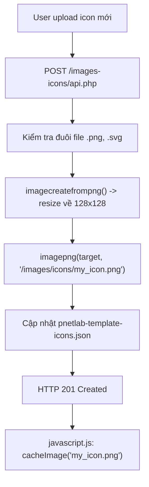

# SƠ ĐỒ GỌI HÀM (CALL GRAPH): F53 - CUSTOM ICON MANAGER

```mermaid
graph TD
    UPLOAD["User upload icon mới"] --> API["POST /images-icons/api.php"]
    API --> CHECK_TYPE["Kiểm tra đuôi file .png, .svg"]
    CHECK_TYPE --> GD_RESIZE["imagecreatefrompng() -> resize về 128x128"]
    GD_RESIZE --> SAVE_DISK["imagepng(target, '/images/icons/my_icon.png')"]
    SAVE_DISK --> UPDATE_JSON["Cập nhật pnetlab-template-icons.json"]
    UPDATE_JSON --> RESP["HTTP 201 Created"]
    RESP --> CANVAS_CACHE["javascript.js: cacheImage('my_icon.png')"]
```
