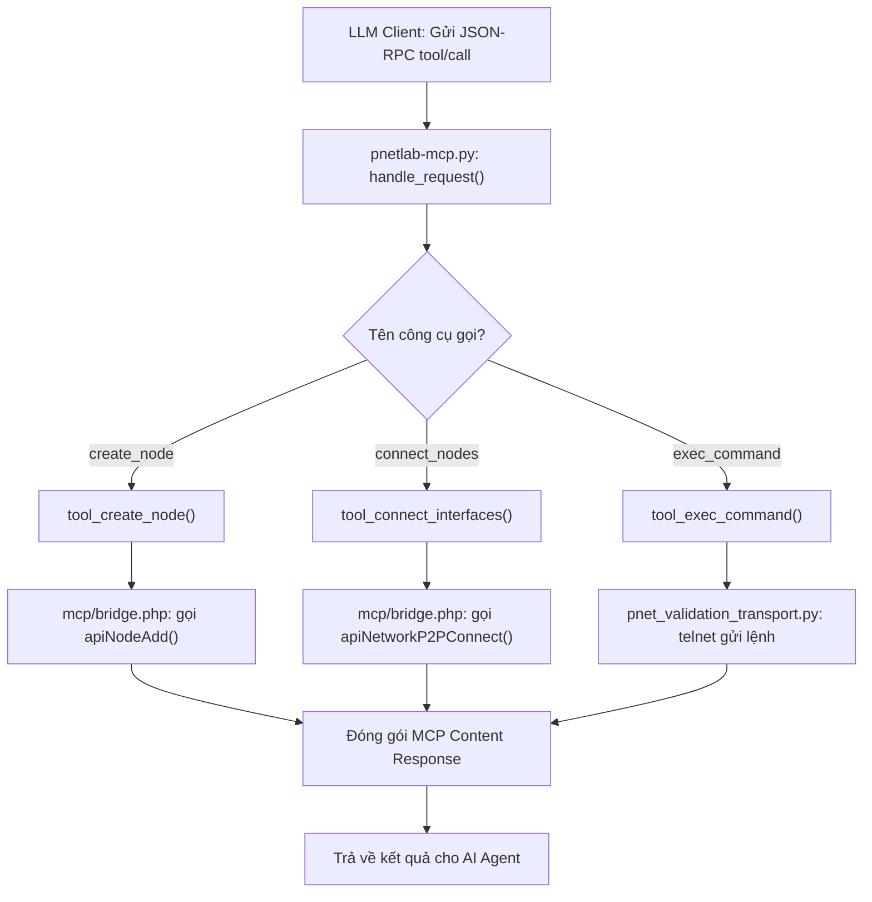

# SƠ ĐỒ GỌI HÀM (CALL GRAPH): F54 - MCP SERVER

```mermaid
graph TD
    AI_CLIENT["LLM Client: Gửi JSON-RPC tool/call"] --> MCP_SERVER["pnetlab-mcp.py: handle_request()"]
    MCP_SERVER --> DISPATCH{"Tên công cụ gọi?"}
    DISPATCH -- create_node --> TOOL_CREATE["tool_create_node()"]
    DISPATCH -- connect_nodes --> TOOL_CONNECT["tool_connect_interfaces()"]
    DISPATCH -- exec_command --> TOOL_EXEC["tool_exec_command()"]
    TOOL_CREATE --> BRIDGE["mcp/bridge.php: gọi apiNodeAdd()"]
    TOOL_CONNECT --> BRIDGE2["mcp/bridge.php: gọi apiNetworkP2PConnect()"]
    TOOL_EXEC --> TRANSPORT["pnet_validation_transport.py: telnet gửi lệnh"]
    BRIDGE --> RESULT["Đóng gói MCP Content Response"]
    BRIDGE2 --> RESULT
    TRANSPORT --> RESULT
    RESULT --> RETURN_JSON["Trả về kết quả cho AI Agent"]
```
