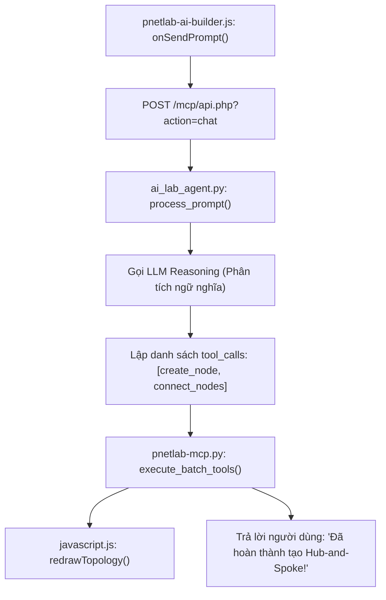

# SƠ ĐỒ GỌI HÀM (CALL GRAPH): F55 - AI LAB BUILDER

```mermaid
graph TD
    CHAT_INPUT["pnetlab-ai-builder.js: onSendPrompt()"] --> POST_API["POST /mcp/api.php?action=chat"]
    POST_API --> AGENT_PY["ai_lab_agent.py: process_prompt()"]
    AGENT_PY --> LLM_CALL["Gọi LLM Reasoning (Phân tích ngữ nghĩa)"]
    LLM_CALL --> PLAN_ACTIONS["Lập danh sách tool_calls: [create_node, connect_nodes]"]
    PLAN_ACTIONS --> MCP_EXEC["pnetlab-mcp.py: execute_batch_tools()"]
    MCP_EXEC --> REFRESH_CANVAS["javascript.js: redrawTopology()"]
    MCP_EXEC --> CHAT_RESP["Trả lời người dùng: 'Đã hoàn thành tạo Hub-and-Spoke!'"]
```
