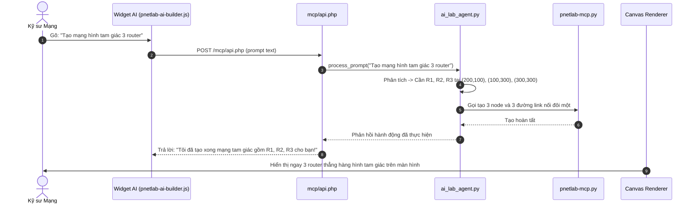

# SƠ ĐỒ TRÌNH TỰ (SEQUENCE DIAGRAM): F55 - AI LAB BUILDER

```mermaid
sequenceDiagram
    autonumber
    actor User as Kỹ sư Mạng
    participant Chat as Widget AI (pnetlab-ai-builder.js)
    participant API as mcp/api.php
    participant Agent as ai_lab_agent.py
    participant MCP as pnetlab-mcp.py
    participant Canvas as Canvas Renderer

    User->>Chat: Gõ: "Tạo mạng hình tam giác 3 router"
    Chat->>API: POST /mcp/api.php (prompt text)
    API->>Agent: process_prompt("Tạo mạng hình tam giác 3 router")
    Agent->>Agent: Phân tích -> Cần R1, R2, R3 tại (200,100), (100,300), (300,300)
    Agent->>MCP: Gọi tạo 3 node và 3 đường link nối đôi một
    MCP-->>Agent: Tạo hoàn tất
    Agent-->>API: Phản hồi hành động đã thực hiện
    API-->>Chat: Trả lời: "Tôi đã tạo xong mạng tam giác gồm R1, R2, R3 cho bạn!"
    Canvas->>User: Hiển thị ngay 3 router thẳng hàng hình tam giác trên màn hình
```
