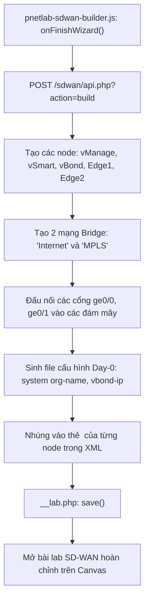

# SƠ ĐỒ GỌI HÀM (CALL GRAPH): F56 - SD-WAN BUILDER

```mermaid
graph TD
    WIZARD_FINISH["pnetlab-sdwan-builder.js: onFinishWizard()"] --> POST_API["POST /sdwan/api.php?action=build"]
    POST_API --> GEN_NODES["Tạo các node: vManage, vSmart, vBond, Edge1, Edge2"]
    GEN_NODES --> GEN_CLOUDS["Tạo 2 mạng Bridge: 'Internet' và 'MPLS'"]
    GEN_CLOUDS --> WIRE_NETS["Đấu nối các cổng ge0/0, ge0/1 vào các đám mây"]
    WIRE_NETS --> BUILD_BOOTSTRAP["Sinh file cấu hình Day-0: system org-name, vbond-ip"]
    BUILD_BOOTSTRAP --> EMBED_CONFIG["Nhúng vào thẻ <config> của từng node trong XML"]
    EMBED_CONFIG --> SAVE_LAB["__lab.php: save()"]
    SAVE_LAB --> OPEN_CANVAS["Mở bài lab SD-WAN hoàn chỉnh trên Canvas"]
```
