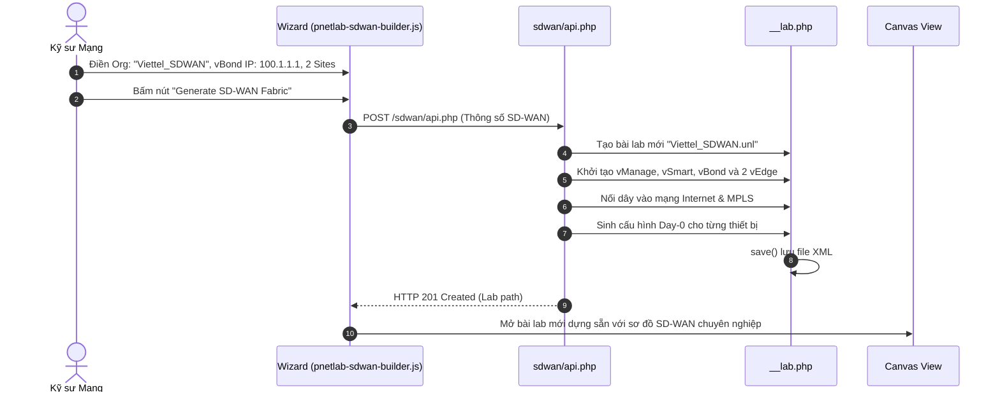

# SƠ ĐỒ TRÌNH TỰ (SEQUENCE DIAGRAM): F56 - SD-WAN BUILDER

```mermaid
sequenceDiagram
    autonumber
    actor User as Kỹ sư Mạng
    participant UI as Wizard (pnetlab-sdwan-builder.js)
    participant API as sdwan/api.php
    participant LabModel as __lab.php
    participant Canvas as Canvas View

    User->>UI: Điền Org: "Viettel_SDWAN", vBond IP: 100.1.1.1, 2 Sites
    User->>UI: Bấm nút "Generate SD-WAN Fabric"
    UI->>API: POST /sdwan/api.php (Thông số SD-WAN)
    API->>LabModel: Tạo bài lab mới "Viettel_SDWAN.unl"
    API->>LabModel: Khởi tạo vManage, vSmart, vBond và 2 vEdge
    API->>LabModel: Nối dây vào mạng Internet & MPLS
    API->>LabModel: Sinh cấu hình Day-0 cho từng thiết bị
    LabModel->>LabModel: save() lưu file XML
    API-->>UI: HTTP 201 Created (Lab path)
    UI->>Canvas: Mở bài lab mới dựng sẵn với sơ đồ SD-WAN chuyên nghiệp
```
