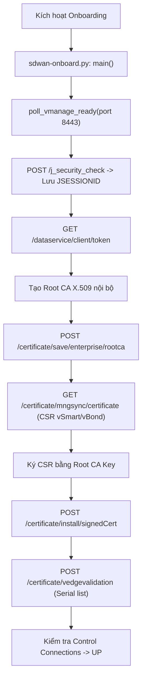

# SƠ ĐỒ GỌI HÀM (CALL GRAPH): F57 - SD-WAN ONBOARDING

```mermaid
graph TD
    TRIGGER["Kích hoạt Onboarding"] --> SCRIPT["sdwan-onboard.py: main()"]
    SCRIPT --> WAIT_VMANAGE["poll_vmanage_ready(port 8443)"]
    WAIT_VMANAGE --> LOGIN["POST /j_security_check -> Lưu JSESSIONID"]
    LOGIN --> CSRF["GET /dataservice/client/token"]
    CSRF --> GEN_ROOT_CA["Tạo Root CA X.509 nội bộ"]
    GEN_ROOT_CA --> UPLOAD_CA["POST /certificate/save/enterprise/rootca"]
    UPLOAD_CA --> FETCH_CSR["GET /certificate/mngsync/certificate (CSR vSmart/vBond)"]
    FETCH_CSR --> SIGN_CERTS["Ký CSR bằng Root CA Key"]
    SIGN_CERTS --> INSTALL_CERTS["POST /certificate/install/signedCert"]
    INSTALL_CERTS --> UPLOAD_SERIAL["POST /certificate/vedgevalidation (Serial list)"]
    UPLOAD_SERIAL --> VERIFY_UP["Kiểm tra Control Connections -> UP"]
```
