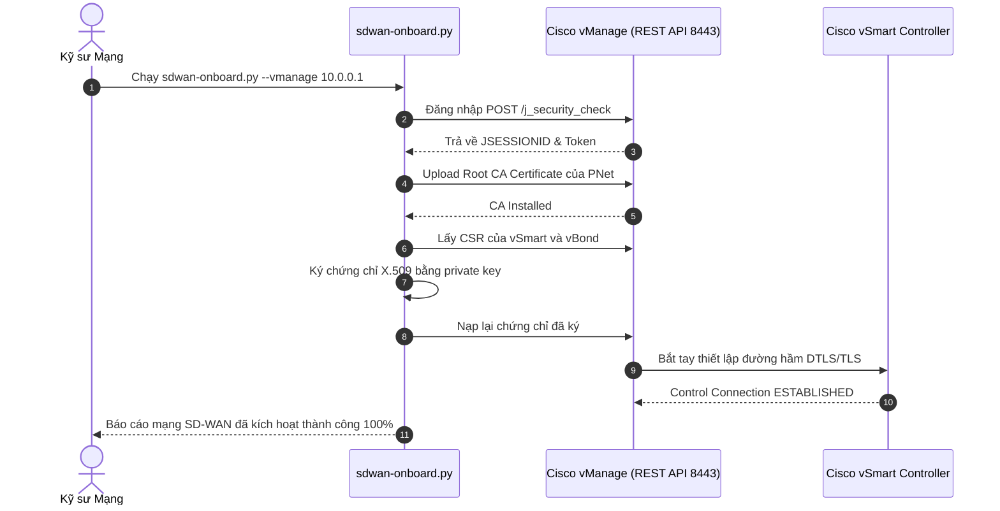

# SƠ ĐỒ TRÌNH TỰ (SEQUENCE DIAGRAM): F57 - SD-WAN ONBOARDING

```mermaid
sequenceDiagram
    autonumber
    actor Admin as Kỹ sư Mạng
    participant Script as sdwan-onboard.py
    participant vManage as Cisco vManage (REST API 8443)
    participant vSmart as Cisco vSmart Controller

    Admin->>Script: Chạy sdwan-onboard.py --vmanage 10.0.0.1
    Script->>vManage: Đăng nhập POST /j_security_check
    vManage-->>Script: Trả về JSESSIONID & Token
    Script->>vManage: Upload Root CA Certificate của PNet
    vManage-->>Script: CA Installed
    Script->>vManage: Lấy CSR của vSmart và vBond
    Script->>Script: Ký chứng chỉ X.509 bằng private key
    Script->>vManage: Nạp lại chứng chỉ đã ký
    vManage->>vSmart: Bắt tay thiết lập đường hầm DTLS/TLS
    vSmart-->>vManage: Control Connection ESTABLISHED
    Script-->>Admin: Báo cáo mạng SD-WAN đã kích hoạt thành công 100%
```
