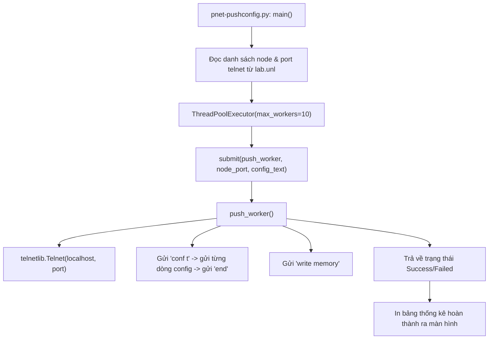

# SƠ ĐỒ GỌI HÀM (CALL GRAPH): F58 - CONFIG PUSH & SCRAPE

```mermaid
graph TD
    START["pnet-pushconfig.py: main()"] --> LOAD_LAB["Đọc danh sách node & port telnet từ lab.unl"]
    LOAD_LAB --> INIT_POOL["ThreadPoolExecutor(max_workers=10)"]
    INIT_POOL --> SUBMIT_TASKS["submit(push_worker, node_port, config_text)"]
    SUBMIT_TASKS --> WORKER["push_worker()"]
    WORKER --> TELNET["telnetlib.Telnet(localhost, port)"]
    WORKER --> SEND_CONF["Gửi 'conf t' -> gửi từng dòng config -> gửi 'end'"]
    WORKER --> SAVE_MEM["Gửi 'write memory'"]
    WORKER --> RESULT["Trả về trạng thái Success/Failed"]
    RESULT --> PRINT_REPORT["In bảng thống kê hoàn thành ra màn hình"]
```
