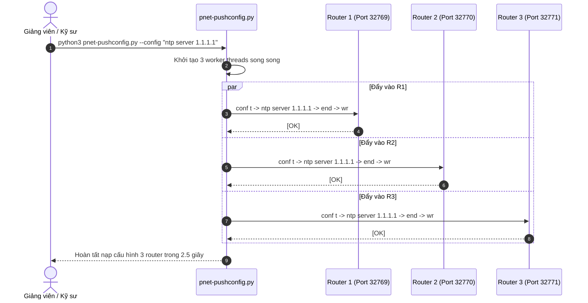

# SƠ ĐỒ TRÌNH TỰ (SEQUENCE DIAGRAM): F58 - CONFIG PUSH & SCRAPE

```mermaid
sequenceDiagram
    autonumber
    actor Admin as Giảng viên / Kỹ sư
    participant Script as pnet-pushconfig.py
    participant R1 as Router 1 (Port 32769)
    participant R2 as Router 2 (Port 32770)
    participant R3 as Router 3 (Port 32771)

    Admin->>Script: python3 pnet-pushconfig.py --config "ntp server 1.1.1.1"
    Script->>Script: Khởi tạo 3 worker threads song song
    par Đẩy vào R1
        Script->>R1: conf t -> ntp server 1.1.1.1 -> end -> wr
        R1-->>Script: [OK]
    and Đẩy vào R2
        Script->>R2: conf t -> ntp server 1.1.1.1 -> end -> wr
        R2-->>Script: [OK]
    and Đẩy vào R3
        Script->>R3: conf t -> ntp server 1.1.1.1 -> end -> wr
        R3-->>Script: [OK]
    end
    Script-->>Admin: Hoàn tất nạp cấu hình 3 router trong 2.5 giây
```
