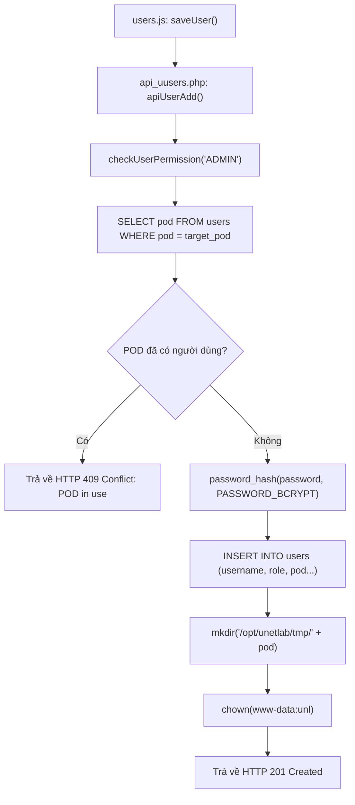

# SƠ ĐỒ GỌI HÀM (CALL GRAPH): F59 - RBAC & POD ISOLATION

```mermaid
graph TD
    ADMIN_UI["users.js: saveUser()"] --> POST_API["api_uusers.php: apiUserAdd()"]
    POST_API --> CHECK_ADMIN["checkUserPermission('ADMIN')"]
    CHECK_ADMIN --> CHECK_POD["SELECT pod FROM users WHERE pod = target_pod"]
    CHECK_POD --> CHECK_DUP{"POD đã có người dùng?"}
    CHECK_DUP -- Có --> ERR["Trả về HTTP 409 Conflict: POD in use"]
    CHECK_DUP -- Không --> HASH_PW["password_hash(password, PASSWORD_BCRYPT)"]
    HASH_PW --> INSERT_DB["INSERT INTO users (username, role, pod...)"]
    INSERT_DB --> MKDIR_POD["mkdir('/opt/unetlab/tmp/' + pod)"]
    MKDIR_POD --> CHOWN_POD["chown(www-data:unl)"]
    CHOWN_POD --> RESP["Trả về HTTP 201 Created"]
```
