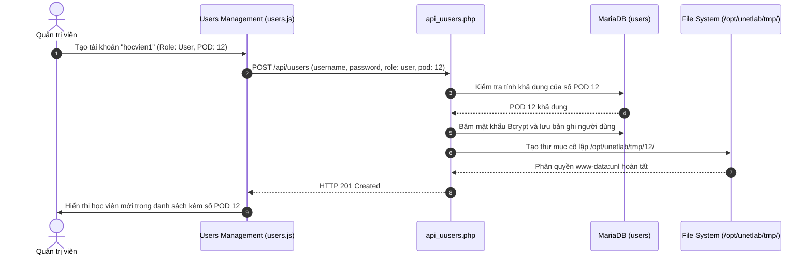

# SƠ ĐỒ TRÌNH TỰ (SEQUENCE DIAGRAM): F59 - RBAC & POD ISOLATION

```mermaid
sequenceDiagram
    autonumber
    actor Admin as Quản trị viên
    participant UI as Users Management (users.js)
    participant API as api_uusers.php
    participant DB as MariaDB (users)
    participant FS as File System (/opt/unetlab/tmp/)

    Admin->>UI: Tạo tài khoản "hocvien1" (Role: User, POD: 12)
    UI->>API: POST /api/uusers (username, password, role: user, pod: 12)
    API->>DB: Kiểm tra tính khả dụng của số POD 12
    DB-->>API: POD 12 khả dụng
    API->>DB: Băm mật khẩu Bcrypt và lưu bản ghi người dùng
    API->>FS: Tạo thư mục cô lập /opt/unetlab/tmp/12/
    FS-->>API: Phân quyền www-data:unl hoàn tất
    API-->>UI: HTTP 201 Created
    UI->>Admin: Hiển thị học viên mới trong danh sách kèm số POD 12
```
