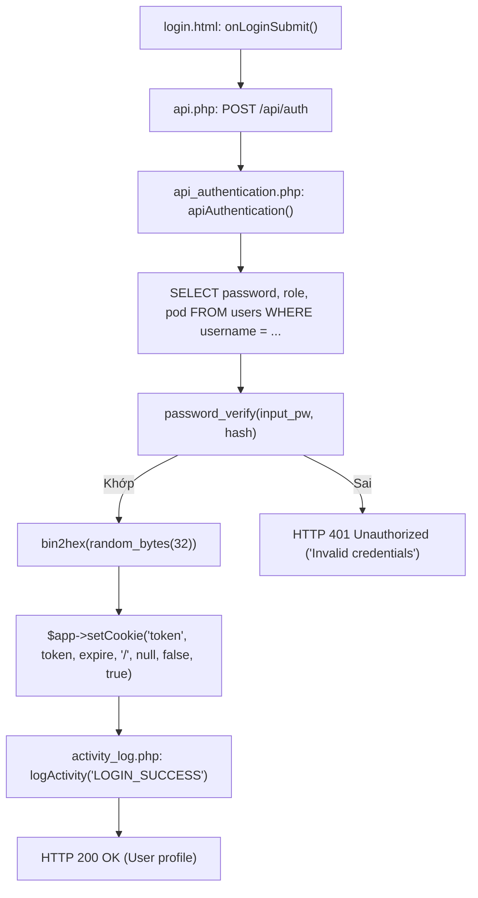

# SƠ ĐỒ GỌI HÀM (CALL GRAPH): F60 - AUTH & SESSION

```mermaid
graph TD
    LOGIN_FORM["login.html: onLoginSubmit()"] --> POST_AUTH["api.php: POST /api/auth"]
    POST_AUTH --> AUTH_SVC["api_authentication.php: apiAuthentication()"]
    AUTH_SVC --> DB_QUERY["SELECT password, role, pod FROM users WHERE username = ..."]
    DB_QUERY --> VERIFY_PW["password_verify(input_pw, hash)"]
    VERIFY_PW -- Khớp --> GEN_TOKEN["bin2hex(random_bytes(32))"]
    GEN_TOKEN --> SET_COOKIE["$app->setCookie('token', token, expire, '/', null, false, true)"]
    SET_COOKIE --> AUDIT_LOG["activity_log.php: logActivity('LOGIN_SUCCESS')"]
    AUDIT_LOG --> RESP_OK["HTTP 200 OK (User profile)"]
    VERIFY_PW -- Sai --> RESP_FAIL["HTTP 401 Unauthorized ('Invalid credentials')"]
```
