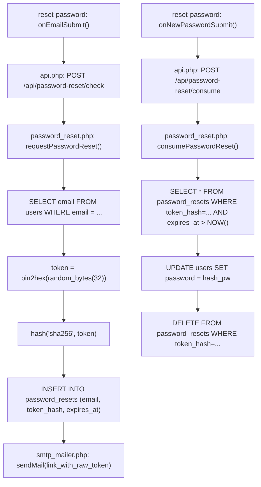

# SƠ ĐỒ GỌI HÀM (CALL GRAPH): F61 - PASSWORD RESET

```mermaid
graph TD
    REQ_FORM["reset-password: onEmailSubmit()"] --> POST_CHECK["api.php: POST /api/password-reset/check"]
    POST_CHECK --> RESET_SVC["password_reset.php: requestPasswordReset()"]
    RESET_SVC --> FIND_USER["SELECT email FROM users WHERE email = ..."]
    FIND_USER --> GEN_RAW["token = bin2hex(random_bytes(32))"]
    GEN_RAW --> HASH_TOKEN["hash('sha256', token)"]
    HASH_TOKEN --> DB_SAVE["INSERT INTO password_resets (email, token_hash, expires_at)"]
    DB_SAVE --> SEND_MAIL["smtp_mailer.php: sendMail(link_with_raw_token)"]
    
    CONSUME["reset-password: onNewPasswordSubmit()"] --> POST_CONSUME["api.php: POST /api/password-reset/consume"]
    POST_CONSUME --> CONSUME_SVC["password_reset.php: consumePasswordReset()"]
    CONSUME_SVC --> VALIDATE_TOKEN["SELECT * FROM password_resets WHERE token_hash=... AND expires_at > NOW()"]
    VALIDATE_TOKEN --> UPDATE_USER["UPDATE users SET password = hash_pw"]
    UPDATE_USER --> DEL_TOKEN["DELETE FROM password_resets WHERE token_hash=..."]
```
