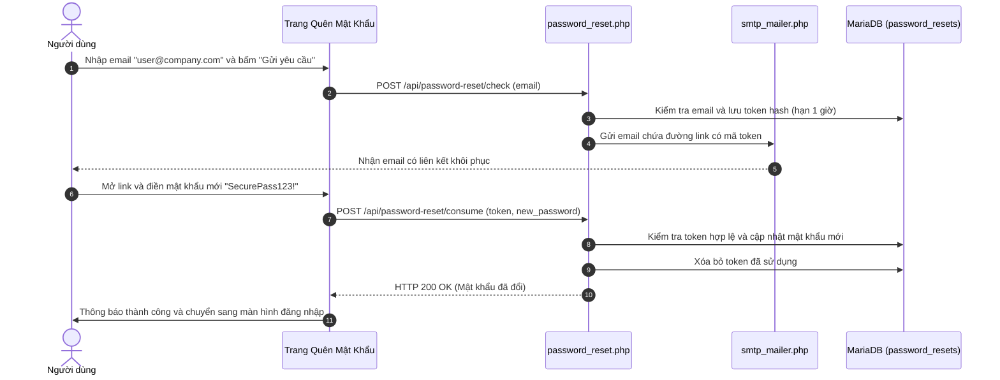

# SƠ ĐỒ TRÌNH TỰ (SEQUENCE DIAGRAM): F61 - PASSWORD RESET

```mermaid
sequenceDiagram
    autonumber
    actor User as Người dùng
    participant UI as Trang Quên Mật Khẩu
    participant API as password_reset.php
    participant Mailer as smtp_mailer.php
    participant DB as MariaDB (password_resets)

    User->>UI: Nhập email "user@company.com" và bấm "Gửi yêu cầu"
    UI->>API: POST /api/password-reset/check (email)
    API->>DB: Kiểm tra email và lưu token hash (hạn 1 giờ)
    API->>Mailer: Gửi email chứa đường link có mã token
    Mailer-->>User: Nhận email có liên kết khôi phục
    User->>UI: Mở link và điền mật khẩu mới "SecurePass123!"
    UI->>API: POST /api/password-reset/consume (token, new_password)
    API->>DB: Kiểm tra token hợp lệ và cập nhật mật khẩu mới
    API->>DB: Xóa bỏ token đã sử dụng
    API-->>UI: HTTP 200 OK (Mật khẩu đã đổi)
    UI->>User: Thông báo thành công và chuyển sang màn hình đăng nhập
```
