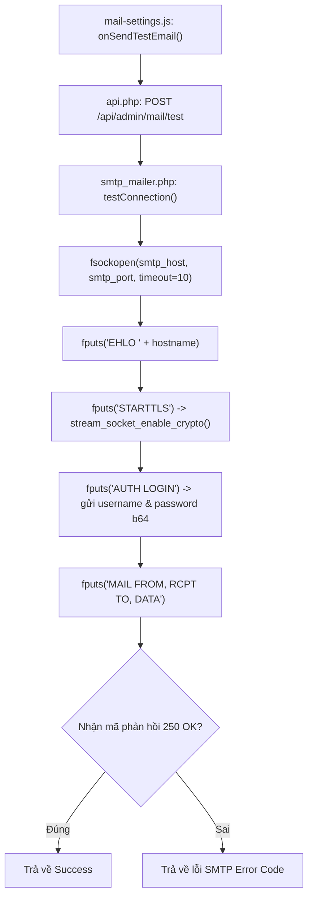

# SƠ ĐỒ GỌI HÀM (CALL GRAPH): F62 - SMTP MAILER

```mermaid
graph TD
    ADMIN_TEST["mail-settings.js: onSendTestEmail()"] --> POST_TEST["api.php: POST /api/admin/mail/test"]
    POST_TEST --> MAILER["smtp_mailer.php: testConnection()"]
    MAILER --> SOCKET_OPEN["fsockopen(smtp_host, smtp_port, timeout=10)"]
    SOCKET_OPEN --> EHLO["fputs('EHLO ' + hostname)"]
    EHLO --> STARTTLS["fputs('STARTTLS') -> stream_socket_enable_crypto()"]
    STARTTLS --> AUTH["fputs('AUTH LOGIN') -> gửi username & password b64"]
    AUTH --> SEND_DATA["fputs('MAIL FROM, RCPT TO, DATA')"]
    SEND_DATA --> VERIFY_250{"Nhận mã phản hồi 250 OK?"}
    VERIFY_250 -- Đúng --> RESP_OK["Trả về Success"]
    VERIFY_250 -- Sai --> RESP_ERR["Trả về lỗi SMTP Error Code"]
```
