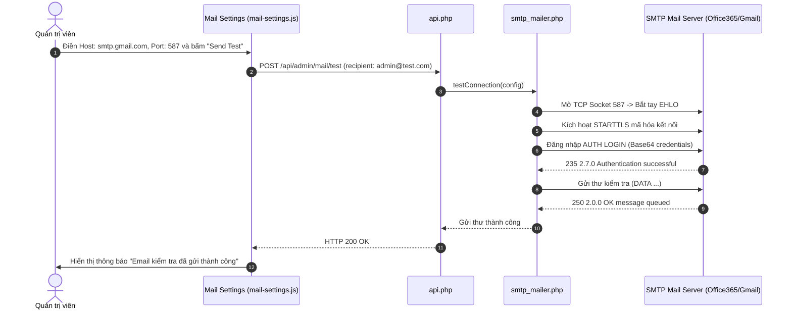

# SƠ ĐỒ TRÌNH TỰ (SEQUENCE DIAGRAM): F62 - SMTP MAILER

```mermaid
sequenceDiagram
    autonumber
    actor Admin as Quản trị viên
    participant UI as Mail Settings (mail-settings.js)
    participant API as api.php
    participant Mailer as smtp_mailer.php
    participant SmtpServer as SMTP Mail Server (Office365/Gmail)

    Admin->>UI: Điền Host: smtp.gmail.com, Port: 587 và bấm "Send Test"
    UI->>API: POST /api/admin/mail/test (recipient: admin@test.com)
    API->>Mailer: testConnection(config)
    Mailer->>SmtpServer: Mở TCP Socket 587 -> Bắt tay EHLO
    Mailer->>SmtpServer: Kích hoạt STARTTLS mã hóa kết nối
    Mailer->>SmtpServer: Đăng nhập AUTH LOGIN (Base64 credentials)
    SmtpServer-->>Mailer: 235 2.7.0 Authentication successful
    Mailer->>SmtpServer: Gửi thư kiểm tra (DATA ...)
    SmtpServer-->>Mailer: 250 2.0.0 OK message queued
    Mailer-->>API: Gửi thư thành công
    API-->>UI: HTTP 200 OK
    UI->>Admin: Hiển thị thông báo "Email kiểm tra đã gửi thành công"
```
