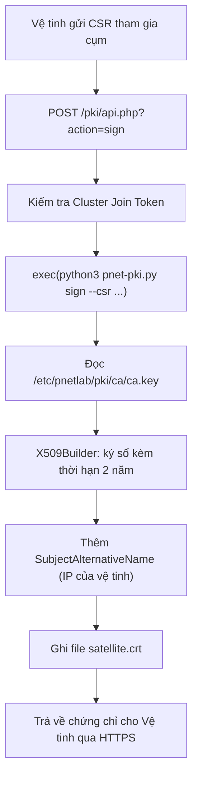

# SƠ ĐỒ GỌI HÀM (CALL GRAPH): F63 - CLUSTER PKI

```mermaid
graph TD
    REQ_JOIN["Vệ tinh gửi CSR tham gia cụm"] --> API["POST /pki/api.php?action=sign"]
    API --> AUTH_TOKEN["Kiểm tra Cluster Join Token"]
    AUTH_TOKEN --> RUN_PKI["exec(python3 pnet-pki.py sign --csr ...)"]
    RUN_PKI --> LOAD_CA["Đọc /etc/pnetlab/pki/ca/ca.key"]
    LOAD_CA --> OPENSSL_SIGN["X509Builder: ký số kèm thời hạn 2 năm"]
    OPENSSL_SIGN --> ADD_SAN["Thêm SubjectAlternativeName (IP của vệ tinh)"]
    ADD_SAN --> WRITE_CERT["Ghi file satellite.crt"]
    WRITE_CERT --> RETURN_CERT["Trả về chứng chỉ cho Vệ tinh qua HTTPS"]
```
