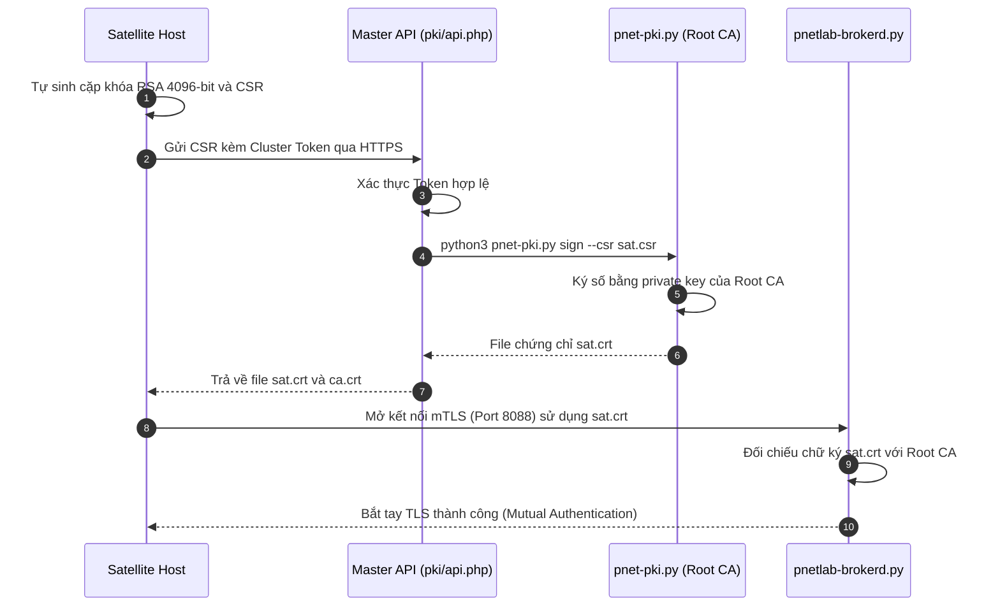

# SƠ ĐỒ TRÌNH TỰ (SEQUENCE DIAGRAM): F63 - CLUSTER PKI

```mermaid
sequenceDiagram
    autonumber
    participant Sat as Satellite Host
    participant API as Master API (pki/api.php)
    participant PKI as pnet-pki.py (Root CA)
    participant Broker as pnetlab-brokerd.py

    Sat->>Sat: Tự sinh cặp khóa RSA 4096-bit và CSR
    Sat->>API: Gửi CSR kèm Cluster Token qua HTTPS
    API->>API: Xác thực Token hợp lệ
    API->>PKI: python3 pnet-pki.py sign --csr sat.csr
    PKI->>PKI: Ký số bằng private key của Root CA
    PKI-->>API: File chứng chỉ sat.crt
    API-->>Sat: Trả về file sat.crt và ca.crt
    Sat->>Broker: Mở kết nối mTLS (Port 8088) sử dụng sat.crt
    Broker->>Broker: Đối chiếu chữ ký sat.crt với Root CA
    Broker-->>Sat: Bắt tay TLS thành công (Mutual Authentication)
```
