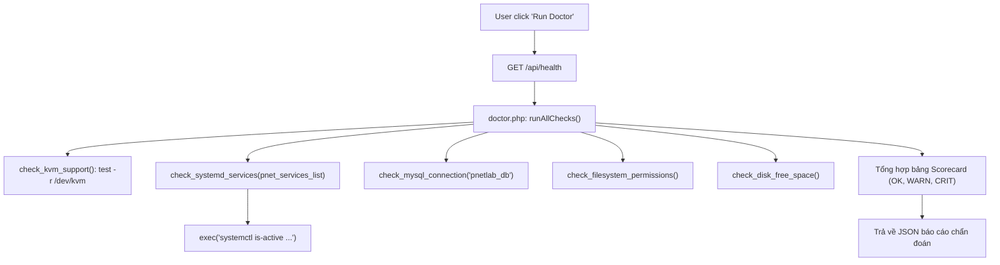

# SƠ ĐỒ GỌI HÀM (CALL GRAPH): F64 - PNET DOCTOR

```mermaid
graph TD
    RUN_DOCTOR["User click 'Run Doctor'"] --> API["GET /api/health"]
    API --> DOCTOR_CORE["doctor.php: runAllChecks()"]
    DOCTOR_CORE --> CHECK_KVM["check_kvm_support(): test -r /dev/kvm"]
    DOCTOR_CORE --> CHECK_SERVICES["check_systemd_services(pnet_services_list)"]
    DOCTOR_CORE --> CHECK_DB["check_mysql_connection('pnetlab_db')"]
    DOCTOR_CORE --> CHECK_PERMS["check_filesystem_permissions()"]
    DOCTOR_CORE --> CHECK_DISK["check_disk_free_space()"]
    CHECK_SERVICES --> SYSTEMCTL["exec('systemctl is-active ...')"]
    DOCTOR_CORE --> SUMMARY["Tổng hợp bảng Scorecard (OK, WARN, CRIT)"]
    SUMMARY --> RETURN_JSON["Trả về JSON báo cáo chẩn đoán"]
```
