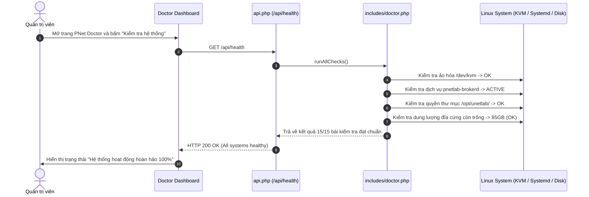

# SƠ ĐỒ TRÌNH TỰ (SEQUENCE DIAGRAM): F64 - PNET DOCTOR

```mermaid
sequenceDiagram
    autonumber
    actor Admin as Quản trị viên
    participant UI as Doctor Dashboard
    participant API as api.php (/api/health)
    participant Doc as includes/doctor.php
    participant OS as Linux System (KVM / Systemd / Disk)

    Admin->>UI: Mở trang PNet Doctor và bấm "Kiểm tra hệ thống"
    UI->>API: GET /api/health
    API->>Doc: runAllChecks()
    Doc->>OS: Kiểm tra ảo hóa /dev/kvm -> OK
    Doc->>OS: Kiểm tra dịch vụ pnetlab-brokerd -> ACTIVE
    Doc->>OS: Kiểm tra quyền thư mục /opt/unetlab/ -> OK
    Doc->>OS: Kiểm tra dung lượng đĩa cứng còn trống -> 85GB (OK)
    Doc-->>API: Trả về kết quả 15/15 bài kiểm tra đạt chuẩn
    API-->>UI: HTTP 200 OK (All systems healthy)
    UI->>Admin: Hiển thị trạng thái "Hệ thống hoạt động hoàn hảo 100%"
```
