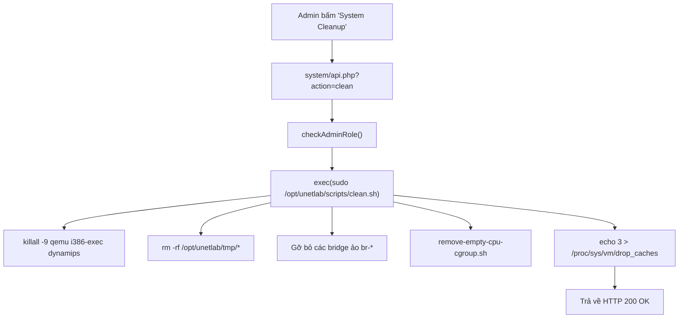

# SƠ ĐỒ GỌI HÀM (CALL GRAPH): F65 - POWER & MAINTENANCE

```mermaid
graph TD
    ADMIN_CLICK["Admin bấm 'System Cleanup'"] --> POST_API["system/api.php?action=clean"]
    POST_API --> CHECK_PERM["checkAdminRole()"]
    CHECK_PERM --> EXEC_CLEAN["exec(sudo /opt/unetlab/scripts/clean.sh)"]
    EXEC_CLEAN --> KILL_PROCS["killall -9 qemu i386-exec dynamips"]
    EXEC_CLEAN --> RM_TMP["rm -rf /opt/unetlab/tmp/*"]
    EXEC_CLEAN --> FLUSH_BRIDGES["Gỡ bỏ các bridge ảo br-*"]
    EXEC_CLEAN --> CLEAN_CGROUPS["remove-empty-cpu-cgroup.sh"]
    EXEC_CLEAN --> DROP_CACHE["echo 3 > /proc/sys/vm/drop_caches"]
    DROP_CACHE --> RESP["Trả về HTTP 200 OK"]
```
