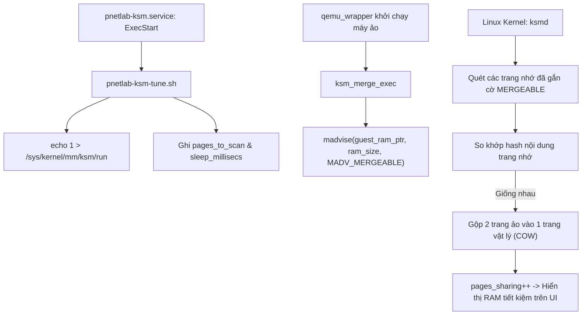

# SƠ ĐỒ GỌI HÀM (CALL GRAPH): F66 - KSM MEMORY TUNING

```mermaid
graph TD
    SERVICE_START["pnetlab-ksm.service: ExecStart"] --> TUNE_SH["pnetlab-ksm-tune.sh"]
    TUNE_SH --> ENABLE_KSM["echo 1 > /sys/kernel/mm/ksm/run"]
    TUNE_SH --> TUNE_PARAMS["Ghi pages_to_scan & sleep_millisecs"]
    
    QEMU_LAUNCH["qemu_wrapper khởi chạy máy ảo"] --> KSM_EXEC["ksm_merge_exec"]
    KSM_EXEC --> MADVISE["madvise(guest_ram_ptr, ram_size, MADV_MERGEABLE)"]
    
    KERNEL_DAEMON["Linux Kernel: ksmd"] --> SCAN_PAGES["Quét các trang nhớ đã gắn cờ MERGEABLE"]
    SCAN_PAGES --> COMPARE["So khớp hash nội dung trang nhớ"]
    COMPARE -- Giống nhau --> MERGE_PAGE["Gộp 2 trang ảo vào 1 trang vật lý (COW)"]
    MERGE_PAGE --> STATS["pages_sharing++ -> Hiển thị RAM tiết kiệm trên UI"]
```
