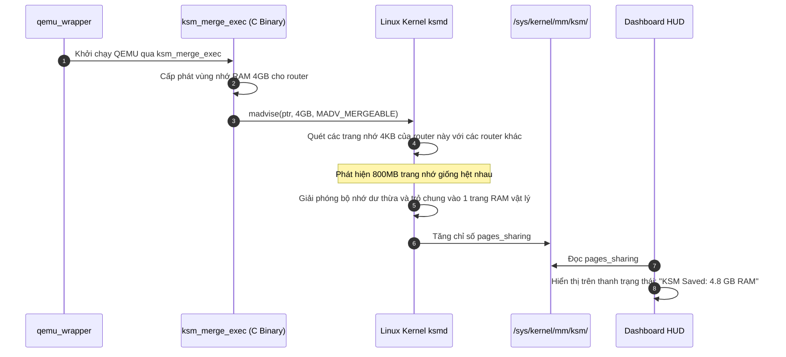

# SƠ ĐỒ TRÌNH TỰ (SEQUENCE DIAGRAM): F66 - KSM MEMORY TUNING

```mermaid
sequenceDiagram
    autonumber
    participant Wrapper as qemu_wrapper
    participant KsmHelper as ksm_merge_exec (C Binary)
    participant Ksmd as Linux Kernel ksmd
    participant Sysfs as /sys/kernel/mm/ksm/
    participant UI as Dashboard HUD

    Wrapper->>KsmHelper: Khởi chạy QEMU qua ksm_merge_exec
    KsmHelper->>KsmHelper: Cấp phát vùng nhớ RAM 4GB cho router
    KsmHelper->>Ksmd: madvise(ptr, 4GB, MADV_MERGEABLE)
    Ksmd->>Ksmd: Quét các trang nhớ 4KB của router này với các router khác
    Note over Ksmd: Phát hiện 800MB trang nhớ giống hệt nhau
    Ksmd->>Ksmd: Giải phóng bộ nhớ dư thừa và trỏ chung vào 1 trang RAM vật lý
    Ksmd->>Sysfs: Tăng chỉ số pages_sharing
    UI->>Sysfs: Đọc pages_sharing
    UI->>UI: Hiển thị trên thanh trạng thái: "KSM Saved: 4.8 GB RAM"
```
