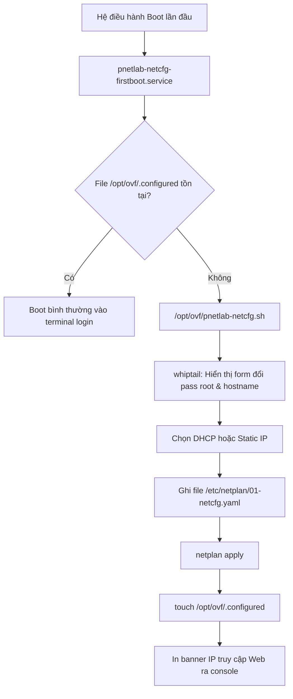

# SƠ ĐỒ GỌI HÀM (CALL GRAPH): F67 - OVF NETWORK INITIALIZATION

```mermaid
graph TD
    BOOT["Hệ điều hành Boot lần đầu"] --> SYSTEMD["pnetlab-netcfg-firstboot.service"]
    SYSTEMD --> CHECK_FLAG{"File /opt/ovf/.configured tồn tại?"}
    CHECK_FLAG -- Có --> EXIT_NORMAL["Boot bình thường vào terminal login"]
    CHECK_FLAG -- Không --> RUN_WIZARD["/opt/ovf/pnetlab-netcfg.sh"]
    RUN_WIZARD --> WHIPTAIL["whiptail: Hiển thị form đổi pass root & hostname"]
    WHIPTAIL --> CHOOSE_IP["Chọn DHCP hoặc Static IP"]
    CHOOSE_IP --> WRITE_NETPLAN["Ghi file /etc/netplan/01-netcfg.yaml"]
    WRITE_NETPLAN --> APPLY_NET["netplan apply"]
    APPLY_NET --> TOUCH_FLAG["touch /opt/ovf/.configured"]
    TOUCH_FLAG --> BANNER["In banner IP truy cập Web ra console"]
```
