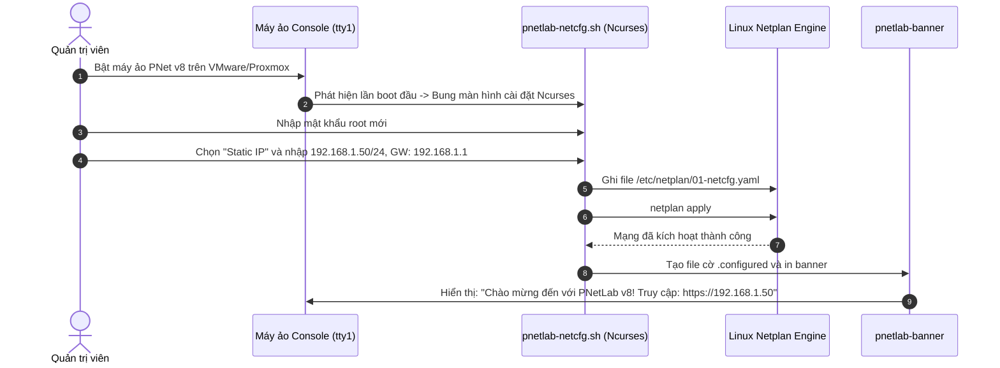

# SƠ ĐỒ TRÌNH TỰ (SEQUENCE DIAGRAM): F67 - OVF NETWORK INITIALIZATION

```mermaid
sequenceDiagram
    autonumber
    actor Admin as Quản trị viên
    participant Console as Máy ảo Console (tty1)
    participant Netcfg as pnetlab-netcfg.sh (Ncurses)
    participant Netplan as Linux Netplan Engine
    participant Banner as pnetlab-banner

    Admin->>Console: Bật máy ảo PNet v8 trên VMware/Proxmox
    Console->>Netcfg: Phát hiện lần boot đầu -> Bung màn hình cài đặt Ncurses
    Admin->>Netcfg: Nhập mật khẩu root mới
    Admin->>Netcfg: Chọn "Static IP" và nhập 192.168.1.50/24, GW: 192.168.1.1
    Netcfg->>Netplan: Ghi file /etc/netplan/01-netcfg.yaml
    Netcfg->>Netplan: netplan apply
    Netplan-->>Netcfg: Mạng đã kích hoạt thành công
    Netcfg->>Banner: Tạo file cờ .configured và in banner
    Banner->>Console: Hiển thị: "Chào mừng đến với PNetLab v8! Truy cập: https://192.168.1.50"
```
