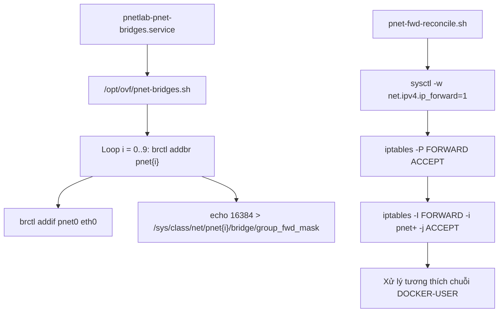

# SƠ ĐỒ GỌI HÀM (CALL GRAPH): F68 - BRIDGE RECONCILE

```mermaid
graph TD
    SVC_START["pnetlab-pnet-bridges.service"] --> RUN_INIT["/opt/ovf/pnet-bridges.sh"]
    RUN_INIT --> LOOP_BR["Loop i = 0..9: brctl addbr pnet{i}"]
    LOOP_BR --> ATTACH_PHY["brctl addif pnet0 eth0"]
    LOOP_BR --> SET_FWD_MASK["echo 16384 > /sys/class/net/pnet{i}/bridge/group_fwd_mask"]
    
    CRON_RECON["pnet-fwd-reconcile.sh"] --> SET_SYSCTL["sysctl -w net.ipv4.ip_forward=1"]
    SET_SYSCTL --> IPTABLES_ACCEPT["iptables -P FORWARD ACCEPT"]
    IPTABLES_ACCEPT --> IPTABLES_RULES["iptables -I FORWARD -i pnet+ -j ACCEPT"]
    IPTABLES_RULES --> DOCKER_RECON["Xử lý tương thích chuỗi DOCKER-USER"]
```
