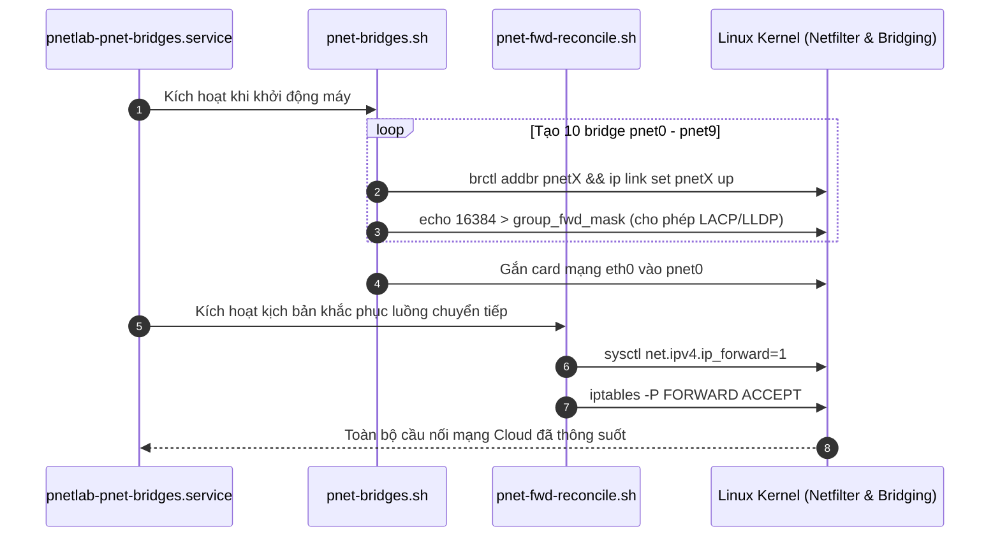

# SƠ ĐỒ TRÌNH TỰ (SEQUENCE DIAGRAM): F68 - BRIDGE RECONCILE

```mermaid
sequenceDiagram
    autonumber
    participant Systemd as pnetlab-pnet-bridges.service
    participant BridgesSh as pnet-bridges.sh
    participant ReconcileSh as pnet-fwd-reconcile.sh
    participant Kernel as Linux Kernel (Netfilter & Bridging)

    Systemd->>BridgesSh: Kích hoạt khi khởi động máy
    loop Tạo 10 bridge pnet0 - pnet9
        BridgesSh->>Kernel: brctl addbr pnetX && ip link set pnetX up
        BridgesSh->>Kernel: echo 16384 > group_fwd_mask (cho phép LACP/LLDP)
    end
    BridgesSh->>Kernel: Gắn card mạng eth0 vào pnet0
    Systemd->>ReconcileSh: Kích hoạt kịch bản khắc phục luồng chuyển tiếp
    ReconcileSh->>Kernel: sysctl net.ipv4.ip_forward=1
    ReconcileSh->>Kernel: iptables -P FORWARD ACCEPT
    Kernel-->>Systemd: Toàn bộ cầu nối mạng Cloud đã thông suốt
```
