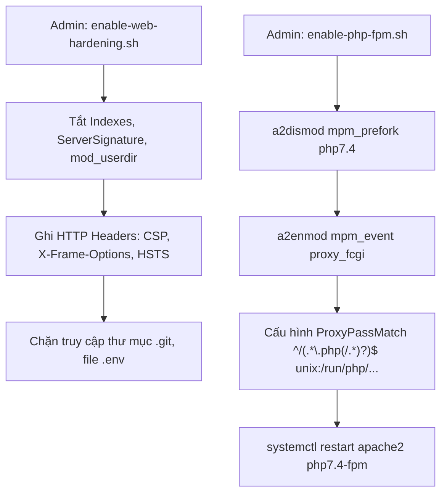

# SƠ ĐỒ GỌI HÀM (CALL GRAPH): F69 - WEB HARDENING & PHP-FPM

```mermaid
graph TD
    RUN_SH["Admin: enable-web-hardening.sh"] --> DISABLE_INSECURE["Tắt Indexes, ServerSignature, mod_userdir"]
    DISABLE_INSECURE --> INJECT_HEADERS["Ghi HTTP Headers: CSP, X-Frame-Options, HSTS"]
    INJECT_HEADERS --> DENY_DOTFILES["Chặn truy cập thư mục .git, file .env"]
    
    RUN_FPM["Admin: enable-php-fpm.sh"] --> A2DIS_PREFORK["a2dismod mpm_prefork php7.4"]
    A2DIS_PREFORK --> A2EN_EVENT["a2enmod mpm_event proxy_fcgi"]
    A2EN_EVENT --> ROUTE_SOCK["Cấu hình ProxyPassMatch ^/(.*\.php(/.*)?)$ unix:/run/php/..."]
    ROUTE_SOCK --> RESTART_SERVICES["systemctl restart apache2 php7.4-fpm"]
```
