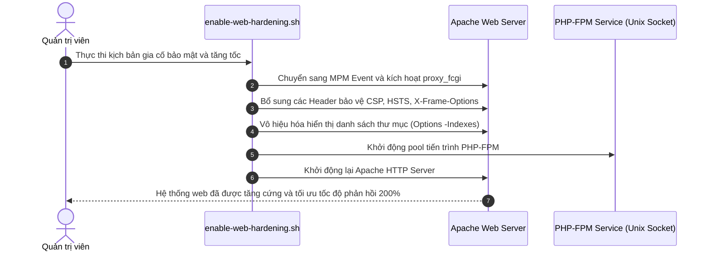

# SƠ ĐỒ TRÌNH TỰ (SEQUENCE DIAGRAM): F69 - WEB HARDENING & PHP-FPM

```mermaid
sequenceDiagram
    autonumber
    actor Admin as Quản trị viên
    participant Script as enable-web-hardening.sh
    participant Apache as Apache Web Server
    participant FPM as PHP-FPM Service (Unix Socket)

    Admin->>Script: Thực thi kịch bản gia cố bảo mật và tăng tốc
    Script->>Apache: Chuyển sang MPM Event và kích hoạt proxy_fcgi
    Script->>Apache: Bổ sung các Header bảo vệ CSP, HSTS, X-Frame-Options
    Script->>Apache: Vô hiệu hóa hiển thị danh sách thư mục (Options -Indexes)
    Script->>FPM: Khởi động pool tiến trình PHP-FPM
    Script->>Apache: Khởi động lại Apache HTTP Server
    Apache-->>Admin: Hệ thống web đã được tăng cứng và tối ưu tốc độ phản hồi 200%
```
