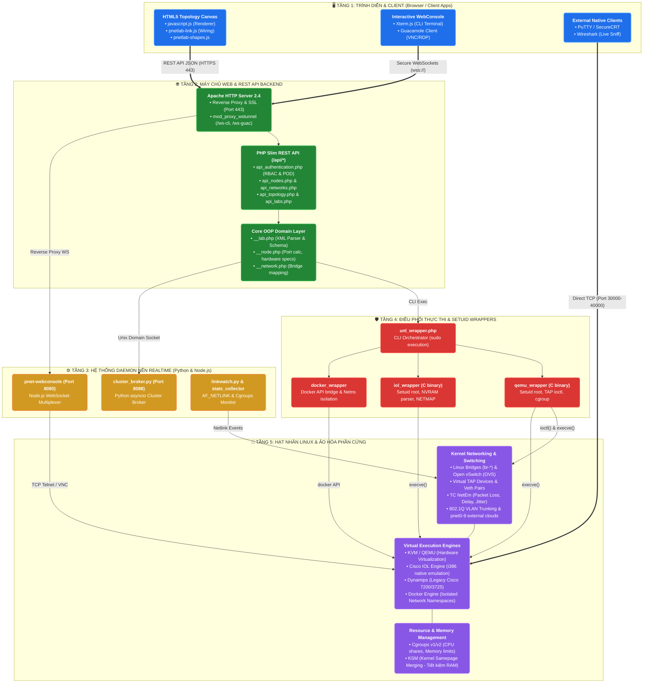

# TÀI LIỆU THIẾT KẾ KIẾN TRÚC PHẦN MỀM (SAD) — PNET V8

Tài liệu này cung cấp cái nhìn toàn cảnh và chuyên sâu về **Kiến trúc Kỹ thuật (Software Architecture & Technical Design)** của nền tảng **PNet v8 (PNETLab v8)**. Tài liệu được thiết kế nhằm giúp các kỹ sư phần mềm, kiến trúc sư hệ thống và kỹ sư hạ tầng hiểu rõ nguyên lý vận hành bên dưới (under the hood), luồng điều khiển, luồng dữ liệu mạng, cách tổ chức thư mục mã nguồn và các quyết định kiến trúc cốt lõi.

---

## 1. Phong cách & Mô hình Kiến trúc Tổng thể (Architectural Styles)

PNet v8 không thuần túy là một ứng dụng Web thông thường mà là một **Hệ thống Lai ghép Hướng Dịch vụ (Service-Oriented Hybrid Architecture)** kết hợp 4 phong cách kiến trúc chính:

1. **Layered Monolith (Phân tầng Đơn khối tại Web & API)**:
   - Giao diện Web Client (HTML5 Canvas + AngularJS) giao tiếp với Backend thông qua RESTful API được xây dựng trên PHP Slim Framework v2/v3.
   - Quản lý phiên, xác thực người dùng, phân quyền POD và các logic nghiệp vụ cấu hình Lab.
2. **Event-Driven Micro-Daemons (Hệ thống Daemon Nền hướng Sự kiện)**:
   - Một mạng lưới các tiến trình nền độc lập chạy bằng **Python asyncio** và **Node.js** chịu trách nhiệm xử lý các tác vụ thời gian thực:
     - `pnet-webconsole` (Node.js WebSocket CLI bridge): Cầu nối streaming terminal trực tiếp vào thiết bị.
     - `cluster_broker.py` (Python asyncio): Điều phối phân tán, quản lý kết nối và đồng bộ trạng thái Cluster Satellite.
     - `linkwatch.py` & `pnet_labstate.py`: Giám sát lưu lượng mạng, Netlink events và truyền tải trạng thái qua Server-Sent Events (SSE).
3. **Hardware-Level Binary Wrappers (Tầng Bao gói Nhị phân Setuid Root C/C++)**:
   - Để tối ưu hóa hiệu năng và bảo mật, các ứng dụng Web (chạy dưới user `www-data`) không trực tiếp gọi lệnh hypervisor.
   - Hệ thống sử dụng tầng Wrapper nhị phân biên dịch sẵn (`qemu_wrapper`, `iol_wrapper`, `docker_wrapper`) có cờ `setuid root`. Các wrapper này hạ đặc quyền an toàn ngay sau khi hoàn tất các tác vụ can thiệp hạt nhân (Kernel ioctl TAP, cgroups, network namespace).
4. **Distributed Master-Satellite Topology (Mô hình Cụm Phân tán)**:
   - Kiến trúc Master điều phối nhiều máy tính Worker (Satellite) thông qua kênh truyền bảo mật mTLS/JSON-RPC, cho phép mở rộng không gian tính toán giả lập theo chiều ngang (Horizontal Scaling).

---

## 2. Kiến trúc Phân tầng Kỹ thuật (Multi-Tier Architecture)

Dưới đây là sơ đồ chi tiết 5 tầng xử lý của hệ thống PNet v8:



---

## 3. Kiến trúc Mạng Ảo hóa (Virtual Networking Architecture)

Cốt lõi tạo nên sức mạnh của PNet v8 là tầng điều khiển mạng ảo hóa hạt nhân (Kernel Data Path):

```
       [ Node Ảo 1 (QEMU) ]                         [ Node Ảo 2 (IOL/Docker) ]
        vNic 0: eth0                                  vNic 0: e0/0
              |                                             |
     [ tap-1-1-0 interface ]                       [ tap-1-2-0 interface ]
              |                                             |
   (tc-netem: delay/loss/jitter)                 (tc-netem: delay/loss/jitter)
              \                                             /
               \--- Gắn kết qua ioctl(SIOCBRADDIF) --------/
                                    |
                       [ Linux Bridge: br-1-1 ]
                  (hoặc Point-to-Point direct link)
                                    |
          +-------------------------+-------------------------+
          | (Tùy chọn: Ra mạng ngoài qua Cloud pnet0-9)       |
          v                                                   v
   [ Card mạng pnet0 ]                                [ Mạng nội bộ Lab ]
   (Bridged ra LAN/Internet)                         (Hoàn toàn cô lập L2)
```

### 3.1. Các Cơ chế Liên kết Mạng (Interconnect Topologies)
1. **Point-to-Point Link (P2P)**:
   - Hai thiết bị kết nối trực tiếp không qua switch trung gian.
   - PNet v8 tối ưu hóa bằng cách kết nối trực tiếp 2 card TAP hoặc sử dụng một bridge siêu nhẹ với chỉ 2 ports, kích hoạt tính năng chuyển tiếp trực tiếp (promiscuous mode) và tắt STP để triệt tiêu độ trễ mạng.
2. **Bridge Network (Multipoint LAN)**:
   - Tạo một Linux Bridge riêng biệt theo công thức định danh: `br-<lab_session_id>-<network_id>`.
   - Tất cả các TAP interface của các node cắm vào mạng này đều được add vào bridge tương ứng, tạo thành một broadcast domain L2 tiêu chuẩn.
3. **Cloud Networks (pnet0 đến pnet9)**:
   - Ánh xạ trực tiếp bridge của lab ra card mạng vật lý của máy chủ chủ (Host NIC) hoặc các sub-interface VLAN (`eth0.100`).
   - `pnet0`: Mạng quản lý mặc định (Management Cloud) có NAT Internet.
   - `pnet1 - pnet9`: Các card mạng mở rộng cho phép kết nối lab với switch/router vật lý bên ngoài phòng lab.
4. **Cross-Satellite Distributed VXLAN Overlay**:
   - Khi một lab được phân bổ chạy trên nhiều máy chủ vệ tinh (Cluster Satellites), các bridge cục bộ giữa các vệ tinh được kết nối với nhau thông qua đường hầm **VXLAN (UDP 4789)** hoặc **GRE Mesh**, đảm bảo gói tin L2 chuyển tiếp trong suốt không phụ thuộc vào vị trí vật lý của máy ảo.

---

## 4. Kiến trúc Phân vùng Bộ nhớ & Dữ liệu (Storage & State Architecture)

PNet v8 tuân thủ triệt để nguyên tắc **Copy-on-Write (CoW)** nhằm tiết kiệm dung lượng lưu trữ đĩa cứng và cho phép khởi chạy hàng trăm máy ảo đồng thời từ một image gốc duy nhất.

```
/opt/unetlab/
├── addons/                                   # KHO IMAGE NGUỒN GỐC (CHỈ ĐỌC - READ ONLY)
│   ├── qemu/                                # QEMU base images (qcow2)
│   │   ├── vios-adventerprisek9-m.15.6.2T/  # virtioa.qcow2 (Gốc, không bao giờ bị ghi đè)
│   │   └── vmx-bundle-21.4R1/
│   ├── iol/bin/                             # Cisco IOL ELF binaries (L2/L3)
│   └── dynamips/                            # Cisco IOS decompressed images
│
├── tmp/                                      # PHÂN VÙNG DỮ LIỆU ĐỘNG (TEMPORARY RUNTIME STATE)
│   └── <pod_id>/                            # Không gian POD của từng người dùng
│       └── <lab_guid>/                      # Định danh phiên Lab đang chạy
│           └── <node_id>/                   # Thư mục làm việc của Node
│               ├── virtioa.qcow2            # QCOW2 OVERLAY DISK (Chỉ lưu phần dữ liệu thay đổi!)
│               │                            # Backing file: /opt/unetlab/addons/qemu/.../virtioa.qcow2
│               ├── nvram                    # Phân vùng cấu hình NVRAM thiết bị
│               ├── startup-config           # File cấu hình khởi động nạp sẵn
│               └── qemu.pid                 # Tiến trình hệ thống đang chạy
│
└── labs/                                     # KHO ĐẶC TẢ PHÒNG THÍ NGHIỆM (PERSISTENT XML)
    ├── admin/
    │   └── CCIE_Enterprise_Demo.unl         # File XML chứa toàn bộ thông số Topo, Tọa độ & Configs
    └── student_group1/
```

### Ưu điểm vượt trội của Kiến trúc CoW:
* **Khởi tạo tức thì**: Một node QEMU 20GB disk có thể tạo mới trong **dưới 100ms** bằng lệnh:
  `qemu-img create -f qcow2 -b <base_image_path> -F qcow2 <overlay_path>`.
* **Wipe (Reset) siêu tốc**: Để khôi phục node về trạng thái ban đầu của nhà sản xuất, hệ thống chỉ cần xóa file overlay và tạo lại một file overlay rỗng mới mà không cần cài đặt lại máy ảo.

---

## 5. Kiến trúc Bảo mật & Phân quyền Cách ly (Security & Isolation Architecture)

1. **Cơ chế POD Multi-Tenancy**:
   - Mỗi người dùng khi đăng nhập vào PNet v8 được gán một không gian định danh gọi là **POD ID** (từ 0 đến 128+).
   - Dải port console của từng user được phân chia toán học riêng biệt:
     $$\text{Console Port} = 30000 + (\text{POD} \times 128) + \text{Node ID}$$
   - Đảm bảo 100 học viên cùng làm một bài lab giống nhau trên một máy chủ không bao giờ bị xung đột cổng hay ghi đè dữ liệu của nhau.
2. **Nguyên tắc Đặc quyền Tối thiểu (Principle of Least Privilege)**:
   - Web Server chạy dưới tài khoản `www-data` không có quyền root.
   - Khi cần can thiệp hệ thống (tạo TAP, chỉnh sửa Bridge), PHP gọi qua `sudo` hoặc các file nhị phân có gán cờ `setuid root`.
   - Sau khi wrapper nhị phân thực hiện xong các hàm hạt nhân `ioctl(TUNSETIFF)` và `ioctl(SIOCBRADDIF)`, nó lập tức gọi hàm `setuid(unl_uid)` để hạ quyền về user bình thường trước khi thực thi tiến trình QEMU/IOL.
3. **Xác thực Token & Console Guard**:
   - Truy cập giao diện và API yêu cầu cookie token xác thực `session_id` được ký và lưu trong MariaDB.
   - Các kết nối WebConsole và VNC/RDP qua WebSocket được bảo vệ bằng cơ chế **Single-Use Console Ticket (Token Minting)** có thời gian sống ngắn (TTL 30 giây), ngăn chặn hoàn toàn tấn công Replay Attack.

---

## 6. Sơ đồ Luồng Dữ liệu Toàn trình (End-to-End Execution Flow)

Sơ đồ tuần tự thể hiện một chu kỳ hoàn chỉnh từ khi người dùng bấm nút **Start Node** trên giao diện Web Canvas cho đến khi thiết bị ảo xuất dữ liệu ra màn hình terminal:

```mermaid
sequenceDiagram
    autonumber
    actor User as Kỹ sư Mạng
    participant UI as Web Canvas (actions.js)
    participant Web as Apache & PHP-FPM
    participant API as api_nodes.php & functions.php
    participant DB as MariaDB & Lab XML (.unl)
    participant UNL as unl_wrapper.php (CLI)
    participant QWRAP as qemu_wrapper (Setuid Binary)
    participant Kernel as Linux Kernel (Bridge/TAP/cgroups)
    participant QEMU as QEMU Process (KVM VMM)
    participant WSC as pnet-webconsole (Node.js)

    User->>UI: Bấm nút "Start" trên Node Icon
    UI->>Web: HTTP POST /api/labs/session/nodes/1/start
    Web->>API: apiNodeStart(tenant_id, lab_file, node_id=1)
    API->>DB: Đọc cấu hình phần cứng (vCPU, RAM, Image, Slot) từ Lab XML
    API->>API: Chuẩn bị thư mục /opt/unetlab/tmp/<pod>/<node_id>/
    API->>API: Tạo QCOW2 overlay disk trỏ về base image
    API->>UNL: sudo [`scripts/unl_wrapper.php`](../scripts/unl_wrapper.php) -a start -d 1
    UNL->>QWRAP: execve([`wrappers/qemu_wrapper`](../wrappers/qemu_wrapper), args)
    
    rect rgb(30, 40, 60)
        Note over QWRAP,Kernel: Tầng Wrapper Nhị phân xử lý đặc quyền root
        QWRAP->>QWRAP: setuid(0) -> Nâng đặc quyền hạt nhân
        QWRAP->>Kernel: ioctl(TUNSETIFF) -> Tạo card mạng TAP (tap-1-1-0)
        QWRAP->>Kernel: ioctl(SIOCBRADDIF) -> Gắn TAP vào Linux Bridge
        QWRAP->>Kernel: Gán PID tiến trình vào /sys/fs/cgroup/cpu,memory
        QWRAP->>QWRAP: setuid(unl_uid) -> Hạ quyền an toàn
        QWRAP->>QEMU: execve(/opt/qemu/bin/qemu-system-x86_64, ...)
    end

    QEMU->>Kernel: Khởi chạy VCPU qua /dev/kvm
    QEMU->>QEMU: Mở Socket TCP Telnet tại Port 32769
    QWRAP-->>UNL: Trả về trạng thái tiến trình thành công (PID)
    UNL-->>API: Status 0
    API-->>Web: JSON Response {code: 200, status: "running"}
    Web-->>UI: Cập nhật Node Icon sang màu xanh lá (Running)

    User->>UI: Click đúp vào Node để mở Console
    UI->>WSC: Kết nối WebSocket wss://.../ws-cli?token=xyz
    WSC->>QEMU: TCP Socket Connect -> localhost:32769
    QEMU-->>WSC: Stream IOS Boot Loader Banner
    WSC-->>UI: Render ký tự lên màn hình Xterm.js
```



---

## 7. Các Quyết định Kiến trúc Then chốt (Architectural Decision Records - ADR)

| ADR ID | Vấn đề Kiến trúc | Giải pháp Lựa chọn | Lý do & Đánh đổi |
| :---: | :--- | :--- | :--- |
| **ADR-01** | Lưu trữ định dạng Phòng Lab | **File XML (.unl)** thay vì Database RDBMS | Cho phép sao lưu, chia sẻ, import/export bài lab cực kỳ đơn giản dưới dạng 1 file duy nhất. Đánh đổi: Cần cơ chế khóa file (Session Lock) khi nhiều người cùng mở 1 lab. |
| **ADR-02** | Khởi chạy máy ảo an toàn từ Web | **Binary Setuid Wrapper** thay vì cấp quyền sudo thẳng cho Apache | Đảm bảo tính bảo mật tối thượng: User `www-data` không thể bị lợi dụng để chiếm quyền root máy chủ Linux thông qua Web shell. |
| **ADR-03** | Truy cập Console không cần phần mềm | **Xterm.js + WebSocket Multiplexer** kết hợp Guacamole | Người dùng chỉ cần trình duyệt web (Chrome/Firefox/Edge) là có thể thao tác cả giao diện dòng lệnh CLI và đồ họa VNC/RDP mà không cần cài đặt SecureCRT/PuTTY. |
| **ADR-04** | Tối ưu hóa bộ nhớ cho Lab lớn | Kích hoạt **Kernel Samepage Merging (KSM)** | Quét và gộp các trang RAM giống nhau của các máy ảo cùng hệ điều hành (ví dụ: 20 con Cisco IOS giống nhau), giúp tiết kiệm từ **40% đến 60% tổng dung lượng RAM**. |
| **ADR-05** | Mở rộng tính toán hệ thống | **Kiến trúc Cụm Master - Satellite** với Broker Python | Phá bỏ giới hạn phần cứng của 1 server đơn lẻ. Các máy chủ vệ tinh có thể đặt ở các phòng server khác nhau và liên kết qua mTLS. |

---

> 📖 **Xem tiếp các tài liệu chuyên sâu**:
> - [**`INDEX.md`**](INDEX.md): Mục lục toàn hệ thống & Bảng tra cứu chéo mã nguồn
> - [**`00-overview.md`**](00-overview.md): SAD Level 0 — Tổng quan Nghiệp vụ & C4 Context
> - [**`01-feature-groups/`**](01-feature-groups/): SAD Level 1 — Kiến trúc 12 Nhóm tính năng lớn
> - [**`03-diagrams/module-dependency.md`**](03-diagrams/module-dependency.md): Bản đồ phụ thuộc tất cả Module mã nguồn
