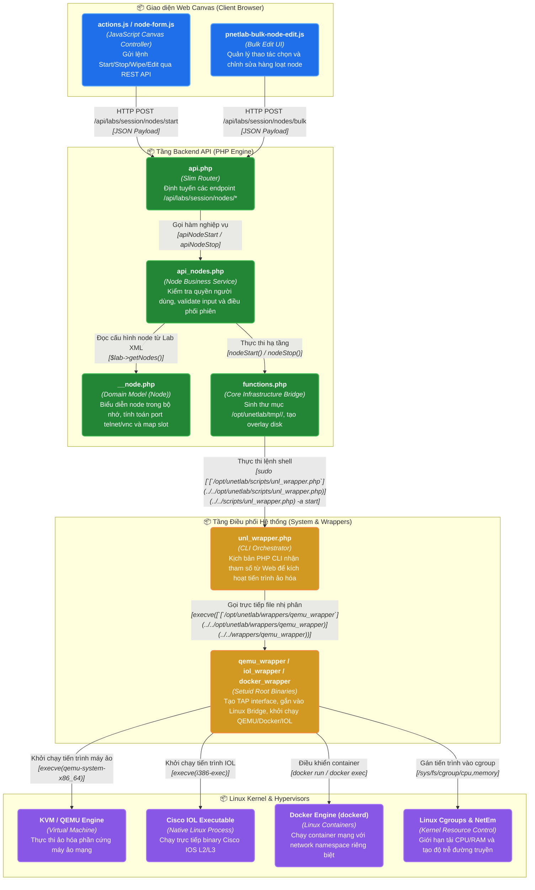

# NHÓM 01: ĐỘNG CƠ GIẢ LẬP & QUẢN LÝ VÒNG ĐỜI NODE (NODE LIFECYCLE & EMULATION ENGINE)

## 1. Mục đích của Nhóm Tính năng

Nhóm **Động cơ Giả lập & Quản lý Vòng đời Node** là trái tim vận hành của toàn bộ nền tảng PNet v8. Nhóm này chịu trách nhiệm:
1. Trừu tượng hóa và thống nhất việc quản lý 5 công nghệ ảo hóa mạng khác nhau: **KVM/QEMU** (Cisco CSR1000v, XRv, Fortigate, Windows/Linux), **Cisco IOL** (IOS-on-Linux L2/L3), **Dynamips** (Cisco router thế hệ cũ c7200, c3725), **Docker Containers** và **VPCS** (Virtual PC Simulator).
2. Kiểm soát toàn bộ vòng đời của một thiết bị mạng ảo: Khởi tạo (`create`), Cấu hình tham số phần cứng (`edit`), Khởi động (`start`), Dừng an toàn hoặc cưỡng bức (`stop`/`kill`), Làm sạch dữ liệu về mặc định (`wipe`), và Trích xuất cấu hình khởi động (`export config`).
3. Cung cấp tầng điều phối nhị phân (Binary Wrapper Layer) chạy dưới quyền đặc quyền (setuid root) để can thiệp trực tiếp vào nhân Linux: tạo TAP interfaces, gán cgroups giới hạn CPU/RAM, cấu hình KSM và mở port console.
4. Xử lý các tác vụ điều khiển hàng loạt (Bulk Operations) trên Canvas như Start All, Stop All, Wipe All và Bulk Edit hàng chục thiết bị cùng lúc.

---

## 2. Danh sách Toàn bộ Tính năng Con Thuộc Nhóm (Dẫn tới Level 2)

Dưới đây là 7 tính năng con độc lập thuộc Nhóm 01, được đặc tả chi tiết tại thư mục `02-features/node-lifecycle/`:

| Mã tính năng | Tên tính năng con | File tài liệu Level 2 | Tóm tắt Chức năng |
| :---: | :--- | :--- | :--- |
| **F01** | **Khởi tạo & Cấu hình Tham số Node** | [`F01-node-create-edit.md`](../02-features/node-lifecycle/F01-node-create-edit.md) | Thêm node mới từ template, chỉnh sửa vCPU, RAM, số card mạng, console type (telnet/vnc/rdp), icon, vị trí Canvas |
| **F02** | **Quy trình Khởi động Node (Start Lifecycle)** | [`F02-node-start-lifecycle.md`](../02-features/node-lifecycle/F02-node-start-lifecycle.md) | Cấp phát Tenant POD, tạo thư mục tạm `/opt/unetlab/tmp/<pod>/<node_id>`, sinh overlay qcow2 disk, tạo card TAP và gọi wrapper |
| **F03** | **Dừng & Hủy Tiến trình Node (Stop & Kill)** | [`F03-node-stop-kill.md`](../02-features/node-lifecycle/F03-node-stop-kill.md) | Gửi tín hiệu ngắt SIGTERM cho tiến trình wrapper, chuyển sang SIGKILL nếu quá thời gian chờ, thu hồi TAP interface |
| **F04** | **Làm sạch Dữ liệu Thiết bị (Node Wipe)** | [`F04-node-wipe-clean.md`](../02-features/node-lifecycle/F04-node-wipe-clean.md) | Xóa toàn bộ file overlay disk, file NVRAM, giải phóng thư mục tạm, khôi phục node về trạng thái ban đầu của image gốc |
| **F05** | **Trích xuất & Lưu trữ Cấu hình (Export Config)** | [`F05-node-export-config.md`](../02-features/node-lifecycle/F05-node-export-config.md) | Đọc file cấu hình `startup-config` từ phân vùng NVRAM hoặc qua console scripting và lưu trực tiếp vào file Lab XML |
| **F06** | **Tầng Điều phối Wrapper Nhị phân (Binary Wrappers)** | [`F06-node-wrapper-orchestration.md`](../02-features/node-lifecycle/F06-node-wrapper-orchestration.md) | Kiến trúc và cơ chế thực thi của `qemu_wrapper`, `iol_wrapper`, `docker_wrapper`, `dynamips_wrapper`, `simple_forwarder` |
| **F07** | **Thao tác Node Hàng loạt (Bulk Operations)** | [`F07-node-bulk-operations.md`](../02-features/node-lifecycle/F07-node-bulk-operations.md) | Điều phối hàng đợi khởi động tuần tự hoặc song song cho toàn bộ lab (Start All, Stop All, Wipe All, Bulk Node Edit) |

---

## 3. Các Module & File Mã nguồn Chịu trách nhiệm Chính

Toàn bộ logic của Nhóm 01 nằm tại các file nguồn cốt lõi sau:

| Đường dẫn File / Thư mục | Ngôn ngữ / Loại | Vai trò chính |
| :--- | :--- | :--- |
| [`/opt/unetlab/html/api.php`](../../opt/unetlab/html/api.php)](../../html/api.php) | PHP (Slim Framework) | Điểm tiếp nhận REST request: `/api/labs/session/nodes`, `/api/labs/session/nodes/(:action)`, `/api/nodestatus` |
| [`/opt/unetlab/html/includes/api_nodes.php`](../../opt/unetlab/html/includes/api_nodes.php)](../../html/includes/api_nodes.php) | PHP | Các hàm xử lý nghiệp vụ node: `apiNodeAdd()`, `apiNodeEdit()`, `apiNodeDelete()`, `apiNodeStart()`, `apiNodeStop()`, `apiNodeWipe()` |
| [`/opt/unetlab/html/includes/__node.php`](../../opt/unetlab/html/includes/__node.php)](../../html/includes/__node.php) | PHP (OOP Domain Object) | Đối tượng `Node`: Đọc ghi thuộc tính node từ Lab XML, tính toán port console, kiểm tra tính hợp lệ của tham số phần cứng |
| [`/opt/unetlab/html/includes/functions.php`](../../opt/unetlab/html/includes/functions.php)](../../html/includes/functions.php) | PHP | Tầng điều phối hạ tầng: `nodeStart()`, `nodeStop()`, `nodeWipe()`, `nodeExport()`, gọi các script CLI hệ thống |
| [`wrappers`](../../wrappers)/` | C / C++ compiled binaries | `qemu_wrapper`, `iol_wrapper`, `docker_wrapper`, `dynamips_wrapper`, `unl_wrapper`: Tiến trình setuid root khởi chạy hypervisors |
| [`/opt/unetlab/scripts/unl_wrapper.php`](../../opt/unetlab/scripts/unl_wrapper.php)](../../scripts/unl_wrapper.php) | PHP CLI | Cầu nối dòng lệnh giữa API Web và các wrapper nhị phân |
| [`/opt/unetlab/html/themes/default/js/actions.js`](../../opt/unetlab/html/themes/default/js/actions.js)](../../html/themes/default/js/actions.js) | JavaScript | Giao diện điều khiển hành động: Start, Stop, Wipe, Export, Restart, Start Selected |
| [`/opt/unetlab/html/themes/default/js/pnetlab-node-form.js`](../../opt/unetlab/html/themes/default/js/pnetlab-node-form.js)](../../html/themes/default/js/pnetlab-node-form.js) | JavaScript | Form modal cấu hình node (chọn image, template, vCPU, RAM, Ethernet slots) |
| [`/opt/unetlab/html/themes/default/js/pnetlab-bulk-node-edit.js`](../../opt/unetlab/html/themes/default/js/pnetlab-bulk-node-edit.js)](../../html/themes/default/js/pnetlab-bulk-node-edit.js)| JavaScript | Giao diện chỉnh sửa đồng loạt thuộc tính của nhiều node được chọn |

---

## 4. Sơ đồ Component Diagram (C4 Level 3: Node Lifecycle Engine)

Sơ đồ thể hiện các thành phần nội bộ bên trong Nhóm 01 và luồng gọi dữ liệu:

---

> 👉 **Xem chi tiết từng tính năng con**:
> 1. [`F01-node-create-edit.md`](../02-features/node-lifecycle/F01-node-create-edit.md) — Khởi tạo & Cấu hình Tham số Node
> 2. [`F02-node-start-lifecycle.md`](../02-features/node-lifecycle/F02-node-start-lifecycle.md) — Quy trình Khởi động Node (Start Lifecycle)
> 3. [`F03-node-stop-kill.md`](../02-features/node-lifecycle/F03-node-stop-kill.md) — Dừng & Hủy Tiến trình Node (Stop & Kill)
> 4. [`F04-node-wipe-clean.md`](../02-features/node-lifecycle/F04-node-wipe-clean.md) — Làm sạch Dữ liệu Thiết bị (Node Wipe)
> 5. [`F05-node-export-config.md`](../02-features/node-lifecycle/F05-node-export-config.md) — Trích xuất & Lưu trữ Cấu hình (Export Config)
> 6. [`F06-node-wrapper-orchestration.md`](../02-features/node-lifecycle/F06-node-wrapper-orchestration.md) — Tầng Điều phối Wrapper Nhị phân (Binary Wrappers)
> 7. [`F07-node-bulk-operations.md`](../02-features/node-lifecycle/F07-node-bulk-operations.md) — Thao tác Node Hàng loạt (Bulk Operations)
