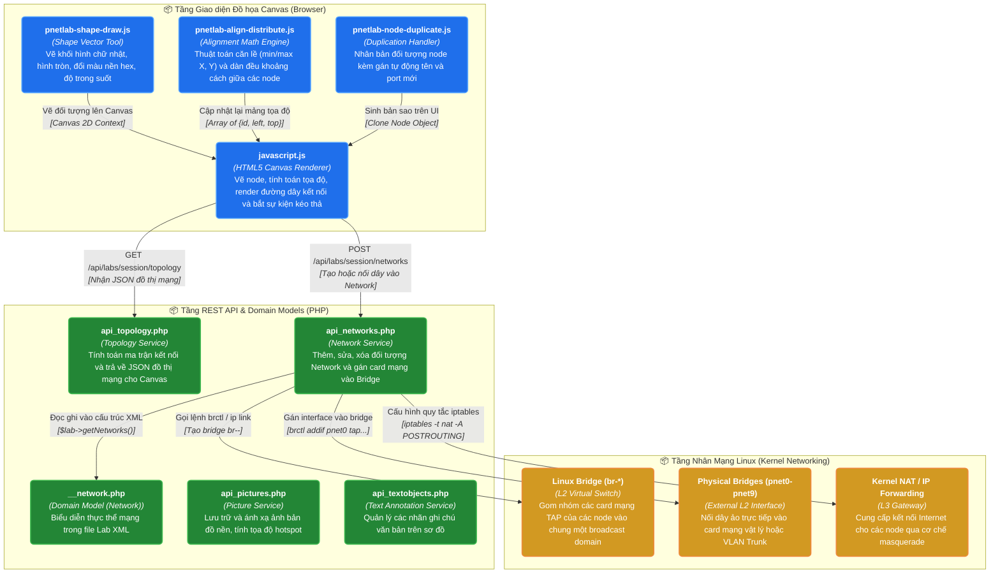

# NHÓM 02: MẠNG KẾT NỐI, TOPO & CANVAS ĐỒ HỌA (NETWORK TOPOLOGY & CANVAS GRAPHIC ENGINE)

## 1. Mục đích của Nhóm Tính năng

Nhóm **Mạng kết nối, Topo & Canvas Đồ họa** chịu trách nhiệm toàn bộ việc mô hình hóa không gian đồ họa tương tác và hạ tầng kết nối mạng ảo trong PNet v8:
1. **Hạ tầng Mạng Ảo (Virtual Switching & Bridging)**: Tạo lập và quản lý các Linux Bridge nội bộ để nối các card mạng ảo (TAP interfaces) giữa các node với nhau; cấu hình mạng Point-to-Point (P2P) tốc độ cao; và kết nối các thiết bị ra mạng vật lý bên ngoài (Cloud Networks từ `pnet0` đến `pnet9` hoặc NAT).
2. **Động cơ Đồ họa Canvas (HTML5 Canvas Engine)**: Cung cấp giao diện tương tác mượt mà hỗ trợ hàng trăm đối tượng node/link/shape/text cùng lúc với đầy đủ chức năng Pan, Zoom, Kéo thả tọa độ (Drag & Drop), Lưới căn chỉnh (Grid snapping), và Lưu vị trí tự động.
3. **Tương tác Nối dây Trực quan (Visual Cable Connection)**: Cho phép người dùng kéo thả đầu dây từ cổng card mạng của node này sang node khác, tự động kiểm tra loại cổng tương thích (Ethernet, GigabitEthernet, Serial, Subslot).
4. **Trang trí & Chú thích Sơ đồ Mạng (Diagramming & Annotations)**: Hỗ trợ vẽ các khối đa giác, hình chữ nhật, hình tròn, đường cong tùy biến màu sắc, độ dày viền, độ trong suốt; thêm nhãn văn bản đa định dạng; và chèn bản đồ ảnh nền (Background Pictures / Data Center Floorplans).
5. **Bộ công cụ Định vị Nâng cao (Alignment & Distribution)**: Cung cấp các thao tác tự động căn thẳng hàng ngang, hàng dọc, dàn đều khoảng cách giữa các node (Distribute spacing), và nhân bản nhanh cấu trúc node (Duplicate).

---

## 2. Danh sách Toàn bộ Tính năng Con Thuộc Nhóm (Dẫn tới Level 2)

Dưới đây là 7 tính năng con độc lập thuộc Nhóm 02, được đặc tả chi tiết tại thư mục `02-features/network-topology/`:

| Mã tính năng | Tên tính năng con | File tài liệu Level 2 | Tóm tắt Chức năng |
| :---: | :--- | :--- | :--- |
| **F08** | **Mạng Cầu nối & Kết nối Đám mây (Bridge & Cloud Networks)** | [`F08-network-bridge-cloud.md`](../02-features/network-topology/F08-network-bridge-cloud.md) | Quản lý Linux Bridge cục bộ và Cloud Interfaces `pnet0-pnet9`, NAT interface ra Internet |
| **F09** | **Kết nối Điểm-Điểm Tối ưu (Point-to-Point Links)** | [`F09-network-p2p-links.md`](../02-features/network-topology/F09-network-p2p-links.md) | Cơ chế đấu nối trực tiếp 2 interface của 2 node qua bridge chuyên dụng mà không cần cloud router |
| **F10** | **Động cơ Vẽ & Tương tác Canvas (Canvas Topology Engine)** | [`F10-canvas-topology-engine.md`](../02-features/network-topology/F10-canvas-topology-engine.md) | Vòng lặp render Canvas HTML5, xử lý sự kiện chuột, Zoom/Pan mượt mà, lưu tọa độ X/Y vào XML |
| **F11** | **Tương tác Nối dây Trực quan (Canvas Link Drawing)** | [`F11-canvas-link-connect.md`](../02-features/network-topology/F11-canvas-link-connect.md) | Luồng kéo dây từ cổng mạng nguồn sang cổng đích, kiểm tra xung đột cổng và cập nhật Topology XML |
| **F12** | **Công cụ Vẽ Khối & Chú thích (Shapes & Annotations)** | [`F12-canvas-shapes-annotations.md`](../02-features/network-topology/F12-canvas-shapes-annotations.md) | Vẽ hình vuông, hình tròn, đường kẻ phân vùng mạng (VLAN, Area, AS), tùy biến màu HEX, opacity, border |
| **F13** | **Bản đồ Ảnh nền Tùy biến (Custom Pictures & Maps)** | [`F13-canvas-custom-pictures.md`](../02-features/network-topology/F13-canvas-custom-pictures.md) | Tải lên ảnh sơ đồ tòa nhà, DC floorplan; ánh xạ các điểm hotspot trên ảnh vào thiết bị trong lab |
| **F14** | **Bộ Công cụ Căn gióng & Nhân bản (Align, Distribute, Duplicate)** | [`F14-canvas-alignment-tools.md`](../02-features/network-topology/F14-canvas-alignment-tools.md) | Tự động căn lề (trái, phải, giữa, ngang, dọc), chia đều khoảng cách các node và sao chép node nhanh |

---

## 3. Các Module & File Mã nguồn Chịu trách nhiệm Chính

| Đường dẫn File / Thư mục | Ngôn ngữ / Loại | Vai trò chính |
| :--- | :--- | :--- |
| [`/opt/unetlab/html/includes/api_networks.php`](../../opt/unetlab/html/includes/api_networks.php)](../../html/includes/api_networks.php) | PHP | Nghiệp vụ mạng: `apiAddLabNetwork()`, `apiEditLabNetwork()`, `apiDeleteLabNetwork()` |
| [`/opt/unetlab/html/includes/__network.php`](../../opt/unetlab/html/includes/__network.php)](../../html/includes/__network.php) | PHP | Domain Object `Network`: Đọc ghi thuộc tính mạng trong Lab XML, gán loại mạng (bridge, pnet) |
| [`/opt/unetlab/html/includes/api_topology.php`](../../opt/unetlab/html/includes/api_topology.php)](../../html/includes/api_topology.php) | PHP | Trả về cấu trúc đồ thị mạng hoàn chỉnh (nodes, links, interfaces) cho Canvas render |
| [`/opt/unetlab/html/includes/api_pictures.php`](../../opt/unetlab/html/includes/api_pictures.php)](../../html/includes/api_pictures.php) | PHP | Xử lý tải ảnh nền, cắt ảnh, lưu trữ và ánh xạ vị trí hotspot |
| [`/opt/unetlab/html/includes/api_textobjects.php`](../../opt/unetlab/html/includes/api_textobjects.php)](../../html/includes/api_textobjects.php)| PHP | Quản lý các đối tượng chữ chú thích (Text Objects) trên Canvas |
| [`/opt/unetlab/html/themes/default/js/javascript.js`](../../opt/unetlab/html/themes/default/js/javascript.js)](../../html/themes/default/js/javascript.js)| JavaScript | Tệp điều khiển chính Canvas, xử lý mouse down/move/up, vẽ icon node và dây mạng |
| [`/opt/unetlab/html/themes/default/js/pnetlab-shape-draw.js`](../../opt/unetlab/html/themes/default/js/pnetlab-shape-draw.js)](../../html/themes/default/js/pnetlab-shape-draw.js)| JavaScript | Bộ công cụ vẽ vector hình khối (Shapes, Rectangles, Circles) |
| [`/opt/unetlab/html/themes/default/js/pnetlab-align-distribute.js`](../../opt/unetlab/html/themes/default/js/pnetlab-align-distribute.js)](../../html/themes/default/js/pnetlab-align-distribute.js)| JavaScript | Thuật toán tính toán tọa độ căn lề và dàn đều khoảng cách node |
| [`/opt/unetlab/html/themes/default/js/pnetlab-node-duplicate.js`](../../opt/unetlab/html/themes/default/js/pnetlab-node-duplicate.js)](../../html/themes/default/js/pnetlab-node-duplicate.js)| JavaScript | Xử lý sao chép node kèm cấu hình và giao diện kết nối |

---

## 4. Sơ đồ Component Diagram (C4 Level 3: Network Topology Engine)

---

> 👉 **Xem chi tiết từng tính năng con**:
> 1. [`F08-network-bridge-cloud.md`](../02-features/network-topology/F08-network-bridge-cloud.md) — Mạng Cầu nối & Kết nối Đám mây (Bridge & Cloud Networks)
> 2. [`F09-network-p2p-links.md`](../02-features/network-topology/F09-network-p2p-links.md) — Kết nối Điểm-Điểm Tối ưu (Point-to-Point Links)
> 3. [`F10-canvas-topology-engine.md`](../02-features/network-topology/F10-canvas-topology-engine.md) — Động cơ Vẽ & Tương tác Canvas (Canvas Topology Engine)
> 4. [`F11-canvas-link-connect.md`](../02-features/network-topology/F11-canvas-link-connect.md) — Tương tác Nối dây Trực quan (Canvas Link Drawing)
> 5. [`F12-canvas-shapes-annotations.md`](../02-features/network-topology/F12-canvas-shapes-annotations.md) — Công cụ Vẽ Khối & Chú thích (Shapes & Annotations)
> 6. [`F13-canvas-custom-pictures.md`](../02-features/network-topology/F13-canvas-custom-pictures.md) — Bản đồ Ảnh nền Tùy biến (Custom Pictures & Maps)
> 7. [`F14-canvas-alignment-tools.md`](../02-features/network-topology/F14-canvas-alignment-tools.md) — Bộ Công cụ Căn gióng & Nhân bản (Align, Distribute, Duplicate)
