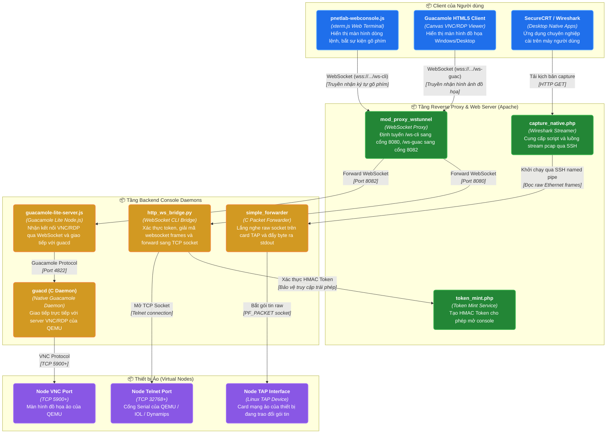

# NHÓM 03: BÀN ĐIỀU KHIỂN & TRUY CẬP TỪ XA (CONSOLE & REMOTE ACCESS SUBSYSTEM)

## 1. Mục đích của Nhóm Tính năng

Nhóm **Bàn điều khiển & Truy cập Từ xa** cung cấp toàn bộ các kênh tương tác dòng lệnh (CLI) và đồ họa (GUI) giữa người dùng và các thiết bị mạng ảo đang chạy trong PNet v8:
1. **WebConsole Không cần Cài đặt (Zero-Install HTML5 Web Console)**: Mở trực tiếp cửa sổ dòng lệnh Telnet, SSH, Serial ngay trên tab trình duyệt web bằng công nghệ WebSocket và xterm.js, hỗ trợ phím tắt, copy/paste, đổi bảng màu và kích thước phông chữ linh hoạt.
2. **Đồ họa Từ xa Web VNC & RDP**: Nhúng màn hình đồ họa máy ảo Windows, Linux Desktop, máy ảo Firewall quản trị web qua bộ chuyển đổi Apache Guacamole Lite kết hợp Node.js và daemon `guacd`.
3. **Cơ chế Token Xác thực Console An toàn**: Ngăn chặn việc truy cập trái phép vào cổng console của thiết bị bằng hệ thống Token một lần có thời hạn (`token_mint.php`, `pnq-labstate-token.php`) và dịch vụ dọn dẹp token hết hạn định kỳ.
4. **Hỗ trợ Ứng dụng Quản trị Native Ngoài (Native Terminal Integration)**: Tích hợp với SecureCRT, PuTTY, SuperPuTTY, Royal TS, MobaXterm thông qua các URL Scheme (`telnet://`, `ssh://`, `pnetlab://`).
5. **Bắt Gói Tin Mạng Trực tiếp (Remote Live Wireshark Capture)**: Bắt luồng gói tin thực tế trên bất kỳ giao diện mạng ảo nào và đẩy luồng pcap về phần mềm Wireshark cài trên máy tính cá nhân của người dùng theo thời gian thực qua named pipe hoặc SSH forwarder.

---

## 2. Danh sách Toàn bộ Tính năng Con Thuộc Nhóm (Dẫn tới Level 2)

Dưới đây là 5 tính năng con độc lập thuộc Nhóm 03, được đặc tả chi tiết tại thư mục `02-features/console-access/`:

| Mã tính năng | Tên tính năng con | File tài liệu Level 2 | Tóm tắt Chức năng |
| :---: | :--- | :--- | :--- |
| **F15** | **Cầu nối WebConsole WebSocket (WebSocket CLI Bridge)** | [`F15-webconsole-websocket-bridge.md`](../02-features/console-access/F15-webconsole-websocket-bridge.md) | Cầu nối 2 chiều giữa WebSocket trên trình duyệt và socket TCP Telnet/SSH thông qua `console_mux.py`, `http_ws_bridge.py` |
| **F16** | **Tích hợp Guacamole HTML5 VNC/RDP** | [`F16-guacamole-html5-vnc-rdp.md`](../02-features/console-access/F16-guacamole-html5-vnc-rdp.md) | Mở màn hình đồ họa VNC/RDP qua `guacamole-lite-server.js`, cơ sở dữ liệu `guacdb` và thư viện guac client |
| **F17** | **Cấp phát & Kiểm thực Token Console (Token Minting)** | [`F17-console-token-minting.md`](../02-features/console-access/F17-console-token-minting.md) | Sinh token băm HMAC gắn liền với phiên người dùng, node ID và thời gian hết hạn để chống tấn công nghe lén console port |
| **F18** | **Tích hợp Giao thức Native Terminal Client** | [`F18-native-console-handler.md`](../02-features/console-access/F18-native-console-handler.md) | Cấu hình mở SecureCRT/PuTTY từ trình duyệt web thông qua giao thức native URL handler và gói phần mềm client pack |
| **F19** | **Bắt Gói tin Wireshark Trực tiếp Từ xa** | [`F19-native-wireshark-capture.md`](../02-features/console-access/F19-native-wireshark-capture.md) | Thu thập luồng raw packet từ TAP interface thông qua `capture_native.php` và `simple_forwarder`, truyền trực tiếp vào Wireshark |

---

## 3. Các Module & File Mã nguồn Chịu trách nhiệm Chính

| Đường dẫn File / Thư mục | Ngôn ngữ / Loại | Vai trò chính |
| :--- | :--- | :--- |
| [`pnet-webconsole/backend/http_ws_bridge.py`](../../pnet-webconsole/backend/http_ws_bridge.py) | Python (asyncio) | Daemon cầu nối WebSocket HTTP: Nhận kết nối ws từ client, xác thực token và mở TCP socket đến console port của node |
| [`pnet-webconsole/backend/console_mux.py`](../../pnet-webconsole/backend/console_mux.py) | Python | Bộ dồn kênh dòng lệnh (Console Multiplexer), quản lý nhiều phiên console đồng thời |
| [`pnet-webconsole/backend/guacamole-lite-server.js`](../../pnet-webconsole/backend/guacamole-lite-server.js) | Node.js | Máy chủ Guacamole Lite: Chuyển đổi giao thức Guacamole tunnel sang WebSocket cho client VNC/RDP |
| [`html/console/token_mint.php`](../../html/console/token_mint.php) | PHP | API cấp phát token bảo mật trước khi mở console |
| [`html/console/capture_native.php`](../../html/console/capture_native.php) | PHP | API sinh kịch bản khởi động Wireshark native và truyền pipe dữ liệu pcap |
| [`wrappers/simple_forwarder`](../../wrappers/simple_forwarder) | C nhị phân | Bộ chuyển tiếp dữ liệu nhị phân raw socket tốc độ cao cho Wireshark capture |
| [`html/themes/default/js/pnetlab-webconsole.js`](../../html/themes/default/js/pnetlab-webconsole.js) | JavaScript | Xử lý giao diện terminal xterm.js, kết nối WebSocket và quản lý tab console |
| `/etc/pnet-webconsole/guac.env` | Config env | Cấu hình biến môi trường kết nối MySQL `guacdb` và daemon `guacd` |

---

## 4. Sơ đồ Component Diagram (C4 Level 3: Console & Remote Access Subsystem)

---

> 👉 **Xem chi tiết từng tính năng con**:
> 1. [`F15-webconsole-websocket-bridge.md`](../02-features/console-access/F15-webconsole-websocket-bridge.md) — Cầu nối WebConsole WebSocket (WebSocket CLI Bridge)
> 2. [`F16-guacamole-html5-vnc-rdp.md`](../02-features/console-access/F16-guacamole-html5-vnc-rdp.md) — Tích hợp Guacamole HTML5 VNC/RDP
> 3. [`F17-console-token-minting.md`](../02-features/console-access/F17-console-token-minting.md) — Cấp phát & Kiểm thực Token Console (Token Minting)
> 4. [`F18-native-console-handler.md`](../02-features/console-access/F18-native-console-handler.md) — Tích hợp Giao thức Native Terminal Client
> 5. [`F19-native-wireshark-capture.md`](../02-features/console-access/F19-native-wireshark-capture.md) — Bắt Gói tin Wireshark Trực tiếp Từ xa
