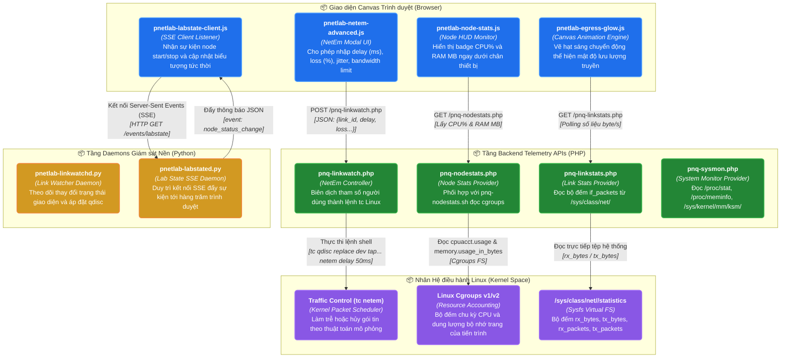

# NHÓM 06: GIẢ LẬP SỰ CỐ MẠNG (NETEM) & GIÁM SÁT THỜI GIAN THỰC (NETEM & REAL-TIME TELEMETRY ENGINE)

## 1. Mục đích của Nhóm Tính năng

Nhóm **Giả lập Sự cố Mạng & Giám sát Thời gian thực** mang lại khả năng mô phỏng môi trường mạng thực tế và trực quan hóa sinh động hoạt động của hệ thống lab:
1. **Động cơ Giả lập Sự cố Đường truyền (Linux NetEm Impairment Engine)**: Can thiệp trực tiếp vào hàng đợi gói tin (Queuing Discipline - `qdisc`) của Linux Kernel để tạo ra các hiện tượng mạng WAN thực tế trên từng liên kết cụ thể: Độ trễ (Latency/Delay), Rung pha (Jitter), Tỷ lệ mất gói (Packet Loss), Gói tin bị hỏng (Corruption), Gói tin trùng lặp (Duplication), Đảo lộn thứ tự gói (Reordering), và Giới hạn băng thông (Bandwidth Rate Limit / TBF).
2. **Daemon Giám sát Trạng thái Link Thời gian thực (`pnetlab-linkwatchd`)**: Daemon Python liên tục kiểm tra trạng thái vật lý và tham số NetEm của các interface mạng ảo, phản hồi tức thời cho giao diện Canvas.
3. **Hiệu ứng Phát sáng Dòng dữ liệu (Live Egress Glow & Link Stats)**: Đọc số lượng gói tin và byte truyền qua từng cổng mạng ảo theo thời gian thực (`pnq-linkstats.php`), kích hoạt hiệu ứng đồ họa phát sáng xung quanh đường dây mạng trên Canvas tương ứng với mật độ lưu lượng truyền.
4. **Giám sát Tiêu thụ Tài nguyên Thiết bị (Per-Node CPU & RAM Monitoring via Cgroups)**: Sử dụng Linux Control Groups (cgroups v1/v2) để đo chính xác mức độ chiếm dụng CPU (%) và dung lượng RAM (MB) của từng tiến trình node ảo độc lập (`pnq-nodestats.php`, `pnq-nodestats.sh`).
5. **Động cơ Đồng bộ Trạng thái Lab Đẩy từ Máy chủ (Real-time SSE Labstate Engine)**: Daemon `pnetlab-labstated.py` duy trì kênh truyền Server-Sent Events (SSE) đẩy liên tục các thay đổi trạng thái (Node chuyển từ Stopped sang Starting, Started, hoặc Error) về trình duyệt mà không cần client phải gửi request thăm dò liên tục (Polling).

---

## 2. Danh sách Toàn bộ Tính năng Con Thuộc Nhóm (Dẫn tới Level 2)

Dưới đây là 6 tính năng con độc lập thuộc Nhóm 06, được đặc tả chi tiết tại thư mục `02-features/netem-telemetry/`:

| Mã tính năng | Tên tính năng con | File tài liệu Level 2 | Tóm tắt Chức năng |
| :---: | :--- | :--- | :--- |
| **F31** | **Bộ Điều khiển Giả lập Sự cố NetEm (NetEm Link Impairment)** | [`F31-netem-link-impairment.md`](../02-features/netem-telemetry/F31-netem-link-impairment.md) | Giao diện cấu hình và lệnh `tc qdisc` thiết lập delay, jitter, loss, duplicate, corrupt và rate limit |
| **F32** | **Daemon Giám sát Liên kết Thời gian thực (Linkwatch Daemon)** | [`F32-live-linkwatch-daemon.md`](../02-features/netem-telemetry/F32-live-linkwatch-daemon.md) | Vận hành của daemon `pnetlab-linkwatchd.py` và API `pnq-linkwatch.php` phát hiện link up/down |
| **F33** | **Thống kê Lưu lượng & Hiệu ứng Phát sáng Dây mạng (Egress Glow)** | [`F33-live-linkstats-egress.md`](../02-features/netem-telemetry/F33-live-linkstats-egress.md) | Thu thập packet counters từ `/sys/class/net/` và render hiệu ứng sáng phát quang động trên Canvas |
| **F34** | **Giám sát Tải CPU/RAM Từng Node qua Linux Cgroups** | [`F34-live-nodestats-cgroups.md`](../02-features/netem-telemetry/F34-live-nodestats-cgroups.md) | Đọc chỉ số từ `/sys/fs/cgroup/cpu` và `/sys/fs/cgroup/memory` gán cho PID của từng node ảo |
| **F35** | **Thu thập Chỉ số Phần cứng Máy chủ (Host System Telemetry)** | [`F35-host-system-telemetry.md`](../02-features/netem-telemetry/F35-host-system-telemetry.md) | Đo tải tổng thể máy chủ: CPU usage, RAM free/used, KSM deduplication rate, Disk I/O qua `pnq-sysmon.php` |
| **F36** | **Kênh Đẩy Trạng thái Lab Thời gian thực qua SSE (Labstate Engine)**| [`F36-realtime-labstate-sse.md`](../02-features/netem-telemetry/F36-realtime-labstate-sse.md) | Cơ chế truyền thông điệp một chiều Server-Sent Events từ `pnetlab-labstated.py` tới `pnetlab-labstate-client.js` |

---

## 3. Các Module & File Mã nguồn Chịu trách nhiệm Chính

| Đường dẫn File / Thư mục | Ngôn ngữ / Loại | Vai trò chính |
| :--- | :--- | :--- |
| [`scripts/pnetlab-linkwatchd.py`](../../scripts/pnetlab-linkwatchd.py) | Python | Daemon giám sát thông số mạng và cập nhật hàng đợi tc qdisc |
| [`scripts/pnetlab-labstated.py`](../../scripts/pnetlab-labstated.py) | Python (asyncio) | Daemon quản lý trạng thái lab theo thời gian thực và phát SSE stream |
| [`html/pnq-linkwatch.php`](../../html/pnq-linkwatch.php) | PHP | REST API tiếp nhận yêu cầu thay đổi tham số NetEm từ UI |
| [`html/pnq-linkstats.php`](../../html/pnq-linkstats.php) | PHP | API trả về số lượng packet/byte trên các interface của lab |
| [`html/pnq-nodestats.php`](../../html/pnq-nodestats.php) | PHP | API trả về tải CPU (%) và RAM (MB) của danh sách node |
| [`html/pnq-nodestats.sh`](../../html/pnq-nodestats.sh) | Shell Script | Script hỗ trợ đọc nhanh cgroups và tính toán CPU % |
| [`html/pnq-sysmon.php`](../../html/pnq-sysmon.php) | PHP | API giám sát thông số tài nguyên toàn máy chủ |
| [`html/themes/default/js/pnetlab-netem-advanced.js`](../../html/themes/default/js/pnetlab-netem-advanced.js) | JavaScript | Hộp thoại cấu hình trực quan tham số NetEm (sliders delay, loss, jitter...) |
| [`html/themes/default/js/pnetlab-egress-glow.js`](../../html/themes/default/js/pnetlab-egress-glow.js) | JavaScript | Hiệu ứng animation hạt sáng chạy dọc theo đường dây trên Canvas |
| [`html/themes/default/js/pnetlab-labstate-client.js`](../../html/themes/default/js/pnetlab-labstate-client.js)| JavaScript | Client nhận luồng SSE từ máy chủ và cập nhật màu sắc node |

---

## 4. Sơ đồ Component Diagram (C4 Level 3: NetEm & Telemetry Engine)

---

> 👉 **Xem chi tiết từng tính năng con**:
> 1. [`F31-netem-link-impairment.md`](../02-features/netem-telemetry/F31-netem-link-impairment.md) — Bộ Điều khiển Giả lập Sự cố NetEm (NetEm Link Impairment)
> 2. [`F32-live-linkwatch-daemon.md`](../02-features/netem-telemetry/F32-live-linkwatch-daemon.md) — Daemon Giám sát Liên kết Thời gian thực (Linkwatch Daemon)
> 3. [`F33-live-linkstats-egress.md`](../02-features/netem-telemetry/F33-live-linkstats-egress.md) — Thống kê Lưu lượng & Hiệu ứng Phát sáng Dây mạng (Egress Glow)
> 4. [`F34-live-nodestats-cgroups.md`](../02-features/netem-telemetry/F34-live-nodestats-cgroups.md) — Giám sát Tải CPU/RAM Từng Node qua Linux Cgroups
> 5. [`F35-host-system-telemetry.md`](../02-features/netem-telemetry/F35-host-system-telemetry.md) — Thu thập Chỉ số Phần cứng Máy chủ (Host System Telemetry)
> 6. [`F36-realtime-labstate-sse.md`](../02-features/netem-telemetry/F36-realtime-labstate-sse.md) — Kênh Đẩy Trạng thái Lab Thời gian thực qua SSE (Labstate Engine)
