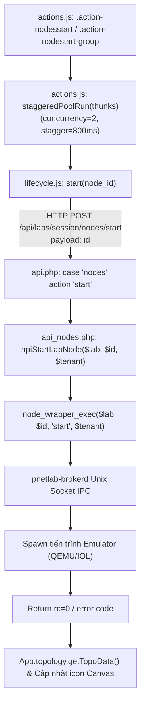

# SƠ ĐỒ GỌI HÀM (CALL GRAPH): F07 - BULK OPERATIONS

```mermaid
graph TD
    UI["actions.js: .action-nodesstart / .action-nodestart-group"] --> POOL["actions.js: staggeredPoolRun(thunks)<br/>(concurrency=2, stagger=800ms)"]
    POOL --> WORKER["lifecycle.js: start(node_id)"]
    WORKER -->|HTTP POST /api/labs/session/nodes/start<br/>payload: id| API["api.php: case 'nodes' action 'start'"]
    API --> CONTROLLER["api_nodes.php: apiStartLabNode($lab, $id, $tenant)"]
    CONTROLLER --> WRAPPER["node_wrapper_exec($lab, $id, 'start', $tenant)"]
    WRAPPER --> BROKER["pnetlab-brokerd Unix Socket IPC"]
    BROKER --> SPAWN["Spawn tiến trình Emulator (QEMU/IOL)"]
    SPAWN --> RET["Return rc=0 / error code"]
    RET --> UI_REFRESH["App.topology.getTopoData() & Cập nhật icon Canvas"]
```
