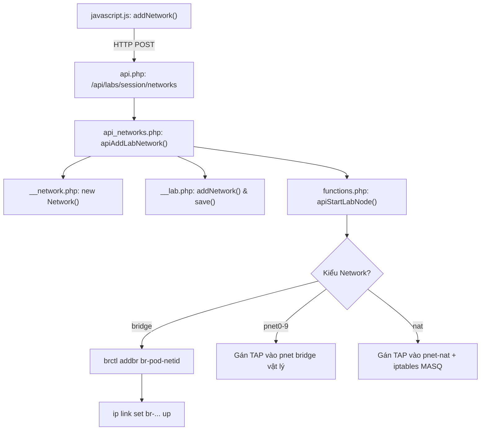

# SƠ ĐỒ GỌI HÀM (CALL GRAPH): F08 - BRIDGE & CLOUD NETWORKS

```mermaid
graph TD
    UI["javascript.js: addNetwork()"] -->|HTTP POST| API["api.php: /api/labs/session/networks"]
    API --> CONTROLLER["api_networks.php: apiAddLabNetwork()"]
    CONTROLLER --> MODEL["__network.php: new Network()"]
    CONTROLLER --> SAVE_XML["__lab.php: addNetwork() & save()"]
    CONTROLLER --> KERNEL_INIT["functions.php: apiStartLabNode()"]
    KERNEL_INIT --> TYPE_CHECK{"Kiểu Network?"}
    TYPE_CHECK -- bridge --> CREATE_BR["brctl addbr br-pod-netid"]
    TYPE_CHECK -- pnet0-9 --> ATTACH_PNET["Gán TAP vào pnet bridge vật lý"]
    TYPE_CHECK -- nat --> ATTACH_NAT["Gán TAP vào pnet-nat + iptables MASQ"]
    CREATE_BR --> SET_UP["ip link set br-... up"]
```
