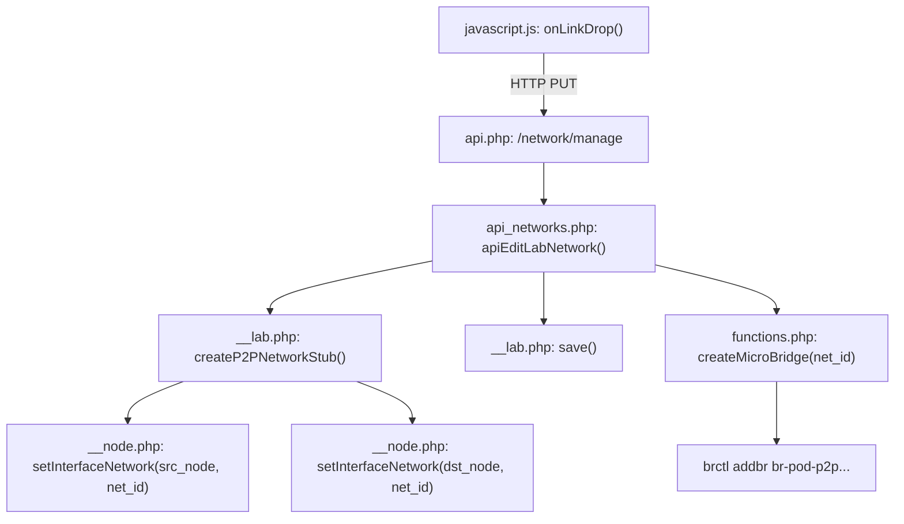

# SƠ ĐỒ GỌI HÀM (CALL GRAPH): F09 - POINT-TO-POINT LINKS

```mermaid
graph TD
    UI["javascript.js: onLinkDrop()"] -->|HTTP PUT| API["api.php: /network/manage"]
    API --> CONTROLLER["api_networks.php: apiEditLabNetwork()"]
    CONTROLLER --> CREATE_STUB["__lab.php: createP2PNetworkStub()"]
    CREATE_STUB --> ATTACH_SRC["__node.php: setInterfaceNetwork(src_node, net_id)"]
    CREATE_STUB --> ATTACH_DST["__node.php: setInterfaceNetwork(dst_node, net_id)"]
    CONTROLLER --> SAVE_LAB["__lab.php: save()"]
    CONTROLLER --> KERNEL_BR["functions.php: createMicroBridge(net_id)"]
    KERNEL_BR --> BRCTL["brctl addbr br-pod-p2p..."]
```
