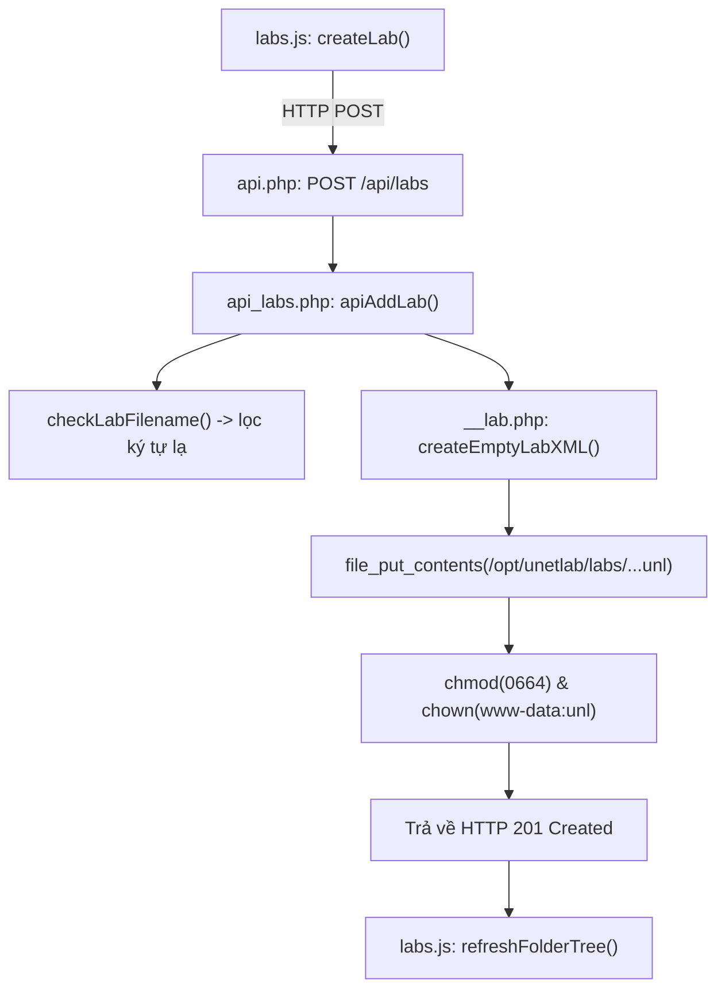

# SƠ ĐỒ GỌI HÀM (CALL GRAPH): F20 - LAB & FOLDER CRUD

```mermaid
graph TD
    UI["labs.js: createLab()"] -->|HTTP POST| API["api.php: POST /api/labs"]
    API --> CONTROLLER["api_labs.php: apiAddLab()"]
    CONTROLLER --> SANITIZE["checkLabFilename() -> lọc ký tự lạ"]
    CONTROLLER --> INIT_XML["__lab.php: createEmptyLabXML()"]
    INIT_XML --> WRITE_FS["file_put_contents(/opt/unetlab/labs/...unl)"]
    WRITE_FS --> CHMOD["chmod(0664) & chown(www-data:unl)"]
    CHMOD --> RESP["Trả về HTTP 201 Created"]
    RESP --> REFRESH_TREE["labs.js: refreshFolderTree()"]
```
