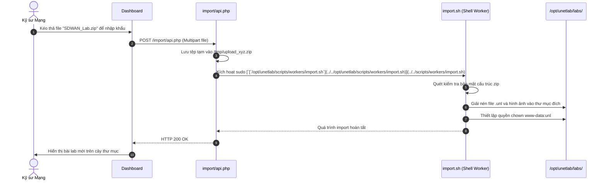

# SƠ ĐỒ TRÌNH TỰ (SEQUENCE DIAGRAM): F22 - ZIP EXPORT & IMPORT

```mermaid
sequenceDiagram
    autonumber
    actor User as Kỹ sư Mạng
    participant UI as Dashboard
    participant API as import/api.php
    participant Worker as import.sh (Shell Worker)
    participant Storage as /opt/unetlab/labs/

    User->>UI: Kéo thả file "SDWAN_Lab.zip" để nhập khẩu
    UI->>API: POST /import/api.php (Multipart file)
    API->>API: Lưu tệp tạm vào /tmp/upload_xyz.zip
    API->>Worker: Kích hoạt sudo [`[`/opt/unetlab/scripts/workers/import.sh`](../../opt/unetlab/scripts/workers/import.sh)](../../scripts/workers/import.sh)
    Worker->>Worker: Quét kiểm tra bảo mật cấu trúc zip
    Worker->>Storage: Giải nén file .unl và hình ảnh vào thư mục đích
    Worker->>Storage: Thiết lập quyền chown www-data:unl
    Worker-->>API: Quá trình import hoàn tất
    API-->>UI: HTTP 200 OK
    UI->>User: Hiển thị bài lab mới trên cây thư mục
```
