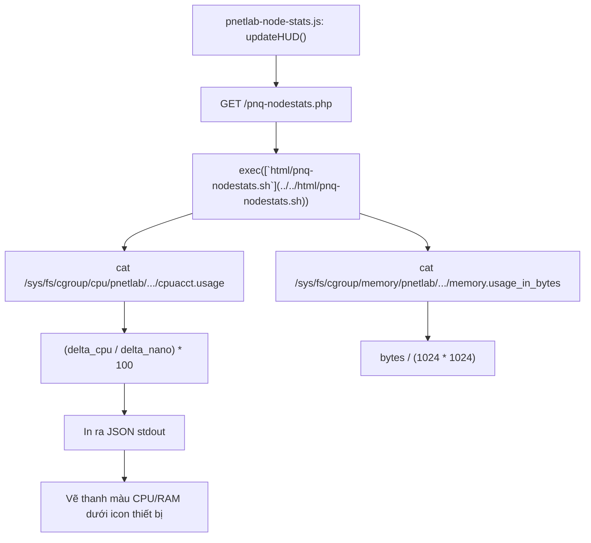

# SƠ ĐỒ GỌI HÀM (CALL GRAPH): F34 - NODE STATS VIA CGROUPS

```mermaid
graph TD
    UI_TIMER["pnetlab-node-stats.js: updateHUD()"] --> GET_API["GET /pnq-nodestats.php"]
    GET_API --> EXEC_SH["exec([`html/pnq-nodestats.sh`](../../html/pnq-nodestats.sh))"]
    EXEC_SH --> READ_CPU["cat /sys/fs/cgroup/cpu/pnetlab/.../cpuacct.usage"]
    EXEC_SH --> READ_MEM["cat /sys/fs/cgroup/memory/pnetlab/.../memory.usage_in_bytes"]
    READ_CPU --> CALC_PERC["(delta_cpu / delta_nano) * 100"]
    READ_MEM --> FORMAT_MB["bytes / (1024 * 1024)"]
    CALC_PERC --> JSON_OUT["In ra JSON stdout"]
    JSON_OUT --> RENDER_BARS["Vẽ thanh màu CPU/RAM dưới icon thiết bị"]
```
