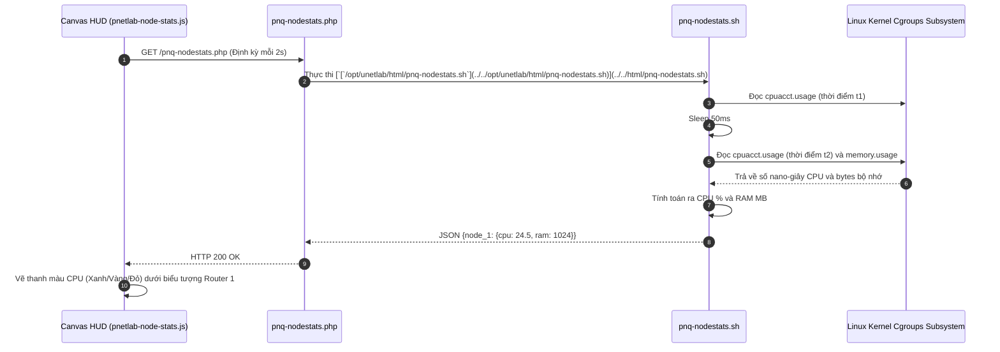

# SƠ ĐỒ TRÌNH TỰ (SEQUENCE DIAGRAM): F34 - NODE STATS VIA CGROUPS

```mermaid
sequenceDiagram
    autonumber
    participant UI as Canvas HUD (pnetlab-node-stats.js)
    participant API as pnq-nodestats.php
    participant Script as pnq-nodestats.sh
    participant Cgroups as Linux Kernel Cgroups Subsystem

    UI->>API: GET /pnq-nodestats.php (Định kỳ mỗi 2s)
    API->>Script: Thực thi [`[`/opt/unetlab/html/pnq-nodestats.sh`](../../opt/unetlab/html/pnq-nodestats.sh)](../../html/pnq-nodestats.sh)
    Script->>Cgroups: Đọc cpuacct.usage (thời điểm t1)
    Script->>Script: Sleep 50ms
    Script->>Cgroups: Đọc cpuacct.usage (thời điểm t2) và memory.usage
    Cgroups-->>Script: Trả về số nano-giây CPU và bytes bộ nhớ
    Script->>Script: Tính toán ra CPU % và RAM MB
    Script-->>API: JSON {node_1: {cpu: 24.5, ram: 1024}}
    API-->>UI: HTTP 200 OK
    UI->>UI: Vẽ thanh màu CPU (Xanh/Vàng/Đỏ) dưới biểu tượng Router 1
```
