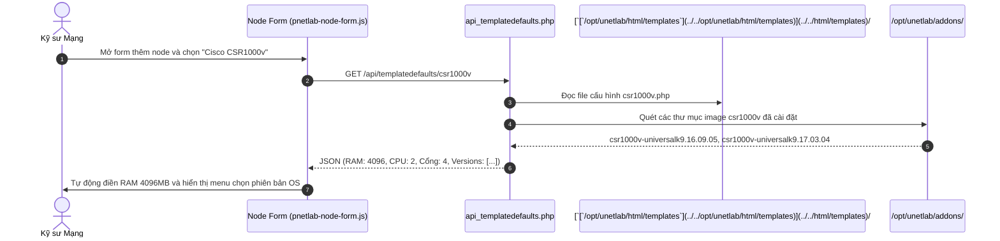

# SƠ ĐỒ TRÌNH TỰ (SEQUENCE DIAGRAM): F48 - TEMPLATE SCHEMA

```mermaid
sequenceDiagram
    autonumber
    actor User as Kỹ sư Mạng
    participant UI as Node Form (pnetlab-node-form.js)
    participant API as api_templatedefaults.php
    participant Templates as [`[`/opt/unetlab/html/templates`](../../opt/unetlab/html/templates)](../../html/templates)/
    participant Addons as /opt/unetlab/addons/

    User->>UI: Mở form thêm node và chọn "Cisco CSR1000v"
    UI->>API: GET /api/templatedefaults/csr1000v
    API->>Templates: Đọc file cấu hình csr1000v.php
    API->>Addons: Quét các thư mục image csr1000v đã cài đặt
    Addons-->>API: csr1000v-universalk9.16.09.05, csr1000v-universalk9.17.03.04
    API-->>UI: JSON (RAM: 4096, CPU: 2, Cổng: 4, Versions: [...])
    UI->>User: Tự động điền RAM 4096MB và hiển thị menu chọn phiên bản OS
```
