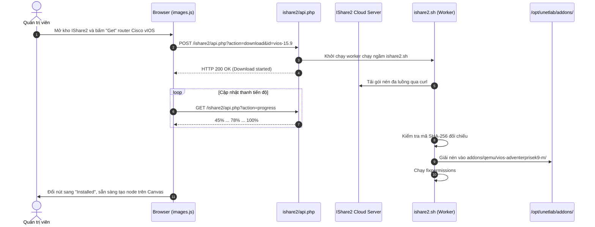

# SƠ ĐỒ TRÌNH TỰ (SEQUENCE DIAGRAM): F51 - ISHARE2 CLOUD STORE

```mermaid
sequenceDiagram
    autonumber
    actor Admin as Quản trị viên
    participant UI as Browser (images.js)
    participant API as ishare2/api.php
    participant Cloud as IShare2 Cloud Server
    participant Worker as ishare2.sh (Worker)
    participant Addons as /opt/unetlab/addons/

    Admin->>UI: Mở kho IShare2 và bấm "Get" router Cisco vIOS
    UI->>API: POST /ishare2/api.php?action=download&id=vios-15.9
    API->>Worker: Khởi chạy worker chạy ngầm ishare2.sh
    API-->>UI: HTTP 200 OK (Download started)
    Worker->>Cloud: Tải gói nén đa luồng qua curl
    loop Cập nhật thanh tiến độ
        UI->>API: GET /ishare2/api.php?action=progress
        API-->>UI: 45% ... 78% ... 100%
    end
    Worker->>Worker: Kiểm tra mã SHA-256 đối chiếu
    Worker->>Addons: Giải nén vào addons/qemu/vios-adventerprisek9-m/
    Worker->>Worker: Chạy fixpermissions
    UI->>Admin: Đổi nút sang "Installed", sẵn sàng tạo node trên Canvas
```
