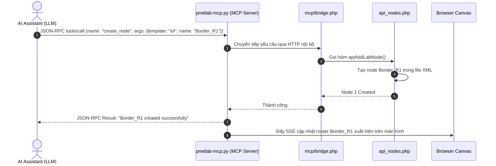

# SƠ ĐỒ TRÌNH TỰ (SEQUENCE DIAGRAM): F54 - MCP SERVER

```mermaid
sequenceDiagram
    autonumber
    actor LLM as AI Assistant (LLM)
    participant MCP as pnetlab-mcp.py (MCP Server)
    participant Bridge as mcp/bridge.php
    participant API as api_nodes.php
    participant Canvas as Browser Canvas

    LLM->>MCP: JSON-RPC tools/call (name: "create_node", args: {template: "iol", name: "Border_R1"})
    MCP->>Bridge: Chuyển tiếp yêu cầu qua HTTP nội bộ
    Bridge->>API: Gọi hàm apiAddLabNode()
    API->>API: Tạo node Border_R1 trong file XML
    API-->>Bridge: Node 1 Created
    Bridge-->>MCP: Thành công
    MCP-->>LLM: JSON-RPC Result: "Border_R1 created successfully"
    MCP->>Canvas: Đẩy SSE cập nhật router Border_R1 xuất hiện trên màn hình
```
