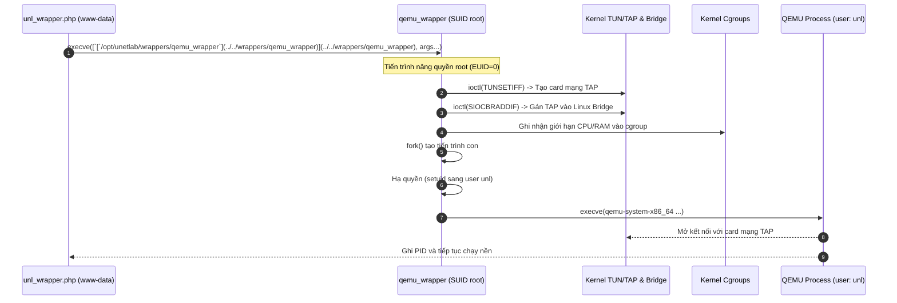

# SƠ ĐỒ TRÌNH TỰ (SEQUENCE DIAGRAM): F06 - BINARY WRAPPERS

```mermaid
sequenceDiagram
    autonumber
    participant Script as unl_wrapper.php (www-data)
    participant CWrap as qemu_wrapper (SUID root)
    participant KernelNet as Kernel TUN/TAP & Bridge
    participant KernelCG as Kernel Cgroups
    participant Hypervisor as QEMU Process (user: unl)

    Script->>CWrap: execve([`[`/opt/unetlab/wrappers/qemu_wrapper`](../../wrappers/qemu_wrapper)](../../wrappers/qemu_wrapper), args...)
    Note over CWrap: Tiến trình nâng quyền root (EUID=0)
    CWrap->>KernelNet: ioctl(TUNSETIFF) -> Tạo card mạng TAP
    CWrap->>KernelNet: ioctl(SIOCBRADDIF) -> Gán TAP vào Linux Bridge
    CWrap->>KernelCG: Ghi nhận giới hạn CPU/RAM vào cgroup
    CWrap->>CWrap: fork() tạo tiến trình con
    CWrap->>CWrap: Hạ quyền (setuid sang user unl)
    CWrap->>Hypervisor: execve(qemu-system-x86_64 ...)
    Hypervisor-->>KernelNet: Mở kết nối với card mạng TAP
    Hypervisor-->>Script: Ghi PID và tiếp tục chạy nền
```
