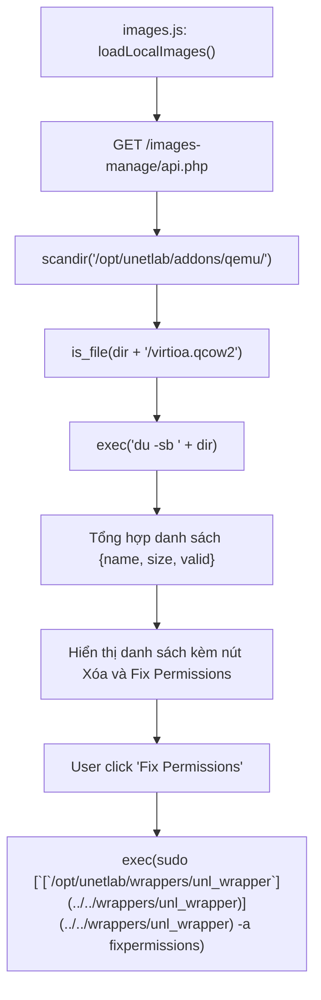

# SƠ ĐỒ GỌI HÀM (CALL GRAPH): F50 - IMAGE FILESYSTEM MANAGER

```mermaid
graph TD
    DASHBOARD["images.js: loadLocalImages()"] --> GET_API["GET /images-manage/api.php"]
    GET_API --> SCAN_QEMU["scandir('/opt/unetlab/addons/qemu/')"]
    SCAN_QEMU --> CHECK_DISK["is_file(dir + '/virtioa.qcow2')"]
    CHECK_DISK --> CALC_SIZE["exec('du -sb ' + dir)"]
    CALC_SIZE --> JSON_PAYLOAD["Tổng hợp danh sách {name, size, valid}"]
    JSON_PAYLOAD --> RENDER_TABLE["Hiển thị danh sách kèm nút Xóa và Fix Permissions"]
    RENDER_TABLE --> CLICK_FIX["User click 'Fix Permissions'"]
    CLICK_FIX --> EXEC_FIX["exec(sudo [`[`/opt/unetlab/wrappers/unl_wrapper`](../../wrappers/unl_wrapper)](../../wrappers/unl_wrapper) -a fixpermissions)"]
```
