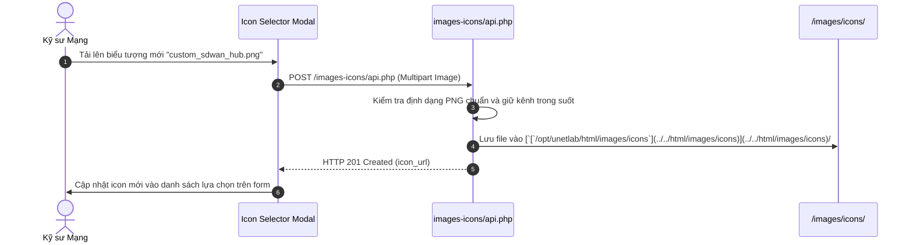

# SƠ ĐỒ TRÌNH TỰ (SEQUENCE DIAGRAM): F53 - CUSTOM ICON MANAGER

```mermaid
sequenceDiagram
    autonumber
    actor User as Kỹ sư Mạng
    participant UI as Icon Selector Modal
    participant API as images-icons/api.php
    participant Storage as /images/icons/

    User->>UI: Tải lên biểu tượng mới "custom_sdwan_hub.png"
    UI->>API: POST /images-icons/api.php (Multipart Image)
    API->>API: Kiểm tra định dạng PNG chuẩn và giữ kênh trong suốt
    API->>Storage: Lưu file vào [`[`/opt/unetlab/html/images/icons`](../../html/images/icons)](../../html/images/icons)/
    API-->>UI: HTTP 201 Created (icon_url)
    UI->>User: Cập nhật icon mới vào danh sách lựa chọn trên form
```
