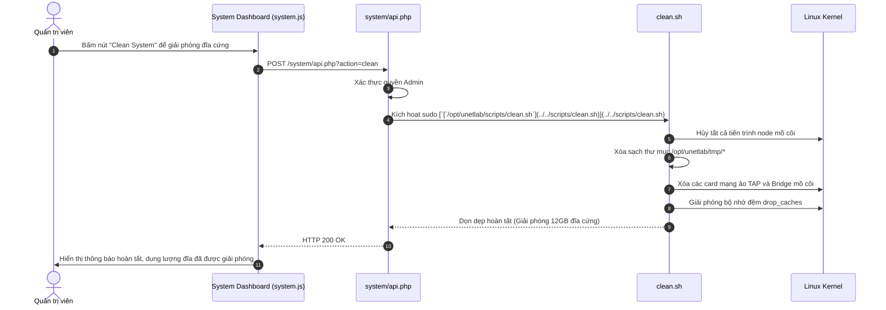

# SƠ ĐỒ TRÌNH TỰ (SEQUENCE DIAGRAM): F65 - POWER & MAINTENANCE

```mermaid
sequenceDiagram
    autonumber
    actor Admin as Quản trị viên
    participant UI as System Dashboard (system.js)
    participant API as system/api.php
    participant Script as clean.sh
    participant Kernel as Linux Kernel

    Admin->>UI: Bấm nút "Clean System" để giải phóng đĩa cứng
    UI->>API: POST /system/api.php?action=clean
    API->>API: Xác thực quyền Admin
    API->>Script: Kích hoạt sudo [`[`/opt/unetlab/scripts/clean.sh`](../../scripts/clean.sh)](../../scripts/clean.sh)
    Script->>Kernel: Hủy tất cả tiến trình node mồ côi
    Script->>Script: Xóa sạch thư mục /opt/unetlab/tmp/*
    Script->>Kernel: Xóa các card mạng ảo TAP và Bridge mồ côi
    Script->>Kernel: Giải phóng bộ nhớ đệm drop_caches
    Script-->>API: Dọn dẹp hoàn tất (Giải phóng 12GB đĩa cứng)
    API-->>UI: HTTP 200 OK
    UI->>Admin: Hiển thị thông báo hoàn tất, dung lượng đĩa đã được giải phóng
```
